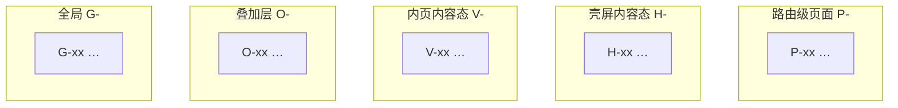

# UI 计划模板（中文 · 通用）

> **结构来源**：按「页面清单 + 设计系统」一体文档分节（§1–§11），与成熟 ui-plan 实例同构；**禁止**从任一项目实例复制业务文案、路由名、具体 hex（除非 PRD/IXD 已给定）。
> **帧 ID**：与 IXD §4 **1:1**（`P-/H-/V-/O-/G-/DS-`），见 `../../references/frame-id-convention.md`。

---

将下方 Markdown **整段** 作为 `docs/specs/ui-plan-<feature>.md` 骨架填写。无内容的表行删除；不适用的节可标「本项目不适用」并简述原因。

```markdown
# UI 规划：<功能名>（页面清单 + 设计系统）

**状态**：草案 v1 | **关联 PRD**：`prd-<feature>.md`（v?） | **关联 IXD**：`ixd-<feature>.md`（v?）  
**最后更新**：YYYY-MM-DD
**设计工具**：（Pixso / Figma / 其他）  
**方法/参考**：（可选：设计探索 skill、品牌指南链接）

---

## 1. 文档目的

汇总本功能的 **全部界面帧**、**设计系统（令牌与组件规划）** 及 **待决事项**，供产品/设计审阅后再进入设计工具出图或开发。

**不包含**：（引用 PRD out-of-scope，如「播放页」「账号体系」等）

---

## 2. 设计定位

| 维度 | 本方案（推荐） | 备选 / 自动探索命中 | 说明 |
| ---- | -------------- | ------------------- | ---- |
| 产品类型 | （如 工具型 / 内容型） | | 与 PRD 用户场景一致 |
| 风格气质 | （如 Minimal / Dense） | | |
| 色彩策略 | （语义令牌 / fromSeed / 固定品牌色） | | 未定则指向 §9 |
| 字体 | （系统默认 / 品牌字体） | | |
| 暗色主题 | （支持 / 仅 Light / 跟随系统） | | |

---

## 3. 设计系统

> 实现技术栈**仅当 PRD 已声明**时写具体 API（如 `ThemeData`、`ColorScheme.fromSeed`）；否则只写语义角色与数值规划。

### 3.1 品牌与主色 / 种子色（待决可列 A/B/C）

| 方案 | 主色 / Seed | 气质 | 备注 |
| ---- | ----------- | ---- | ---- |
| **A（推荐）** | `#______` | | |
| B | `#______` | | |
| C | `#______` | | |

**实现约定**：（如 fromSeed、Design Token 命名空间）

---

### 3.2 色彩令牌（语义表）

以 **推荐方案** 为基准；Light/Dark 可只列语义名，hex 由工具生成或引用 DS-00。

#### Light 语义

| 令牌 | 用途 |
| ---- | ---- |
| `primary` | |
| `onPrimary` | |
| `surface` | 页面背景 |
| `onSurface` | 主标题（对比 ≥4.5:1） |
| `onSurfaceVariant` | 副标题、次要图标 |
| `error` / `onError` | 破坏性操作 |
| `outlineVariant` | 分隔线 |
| （按 IXD/PRD 增补） | |

#### Dark 语义

| 令牌 | 用途 |
| ---- | ---- |
| `surface` | |
| `onSurface` | |
| `primary` | |
| `error` | |

#### 跨主题语义

| 语义 | 映射 | 场景 |
| ---- | ---- | ---- |
| 危险 | `error` | 删除等 |
| 禁用 | `onSurface` @ 38% | |
| 骨架 / 占位 | （如 `surfaceContainerHighest`） | 加载态 |

**反模式**：（项目级禁忌：渐变滥用、emoji 功能图标、无二次确认的删除等）

---

### 3.3 字体与排版

| 层级 | 设计角色（M3 / iOS / 自定义） | 用途 |
| ---- | ----------------------------- | ---- |
| 应用名 / 大标题 | | |
| 页面标题 | | AppBar |
| 列表主标题 | | |
| 列表副标题 | | |
| 空状态标题 / 正文 | | |
| Dialog 标题 / 正文 | | |
| 全局反馈文案 | | Snackbar / Toast |

须支持系统字号缩放（若 PRD 要求）。

---

### 3.4 间距、圆角、触控

| 令牌 | 值 |
| ---- | -- |
| 基础网格 | 4dp（或 4px） |
| 屏幕水平边距 | |
| 列表行最小高度 | |
| 图标 / 操作热区 | 48×48 |
| Sheet 顶圆角 | |
| Dialog 圆角 | |
| AppBar | flat / 有 elevation |

---

### 3.5 图标

| 场景 | 图标名 / 资源 |
| ---- | ------------- |
| （从 IXD 列举） | |

风格：（Outlined / Filled；尺寸 24dp 等）

---

### 3.6 动效

| 场景 | 时长 | 说明 |
| ---- | ---- | ---- |
| 路由转场 | | |
| Sheet / Dialog | | |
| 多选 / 列表反馈 | | |
| 全局提示 | | 停留时长 |
| reduced motion | | 跟随系统 |

---

### 3.7 设计工具组件库（C-*，可选）

> 若 MVP 需要在 Pixso/Figma 建库，列出组件 ID；否则写「首版可不出 DS 组件页，仅令牌」。

| 组件 ID | 名称 | 变体 |
| ------- | ---- | ---- |
| C-AppBar | 顶栏 | 标准 / 多选 / … |
| C-ListRow | 列表行 | default / pressed / multi |
| C-Skeleton | 骨架 | |
| C-Empty | 空状态 | |
| C-BottomSheet | | |
| C-Dialog | | |
| C-Snackbar | | |

---

## 4. 全页面清单

**画板基准**：（项目约定，如 375×812；Android 状态栏差异注明）  
**帧 ID 规则**：与 IXD §4 **完全一致**，不得改名、不得漏态（漏态须在 §4.7 说明）。

### 4.1 结构总览（Mermaid，推荐）



---

### 4.2 路由级页面（P-）

| 帧 ID | 页面名 | 路由 / 导航（建议） | 说明 |
| ----- | ------ | ------------------- | ---- |
| P-00 | | | |
| P-01 | | | 壳屏；下挂 H-* |
| P-xx | | | 内页壳；下挂 V-* |

---

### 4.3 壳屏内容态（H-，挂在 `<父级 P-xx>`）

| 帧 ID | 状态 | 触发 / 进入条件 | 关键 UI |
| ----- | ---- | --------------- | ------- |
| H-01 | | | |
| H-02 | | | |

---

### 4.4 内页内容态（V-，挂在 `<子级 P-xx>`）

| 帧 ID | 状态 | 触发 | 关键 UI |
| ----- | ---- | ---- | ------- |
| V-01 | | | |
| V-02 | | | |

---

### 4.5 叠加层（O-）

| 帧 ID | 名称 | 触发 |
| ----- | ---- | ---- |
| O-01 | | |
| O-03a | | 变体用小写字母后缀 |

**叠加层画法**：（如：底图 H-02 / V-02 @ 40% 透明度 + 前景 Sheet/Dialog；见视觉出图 skill）

---

### 4.6 全局反馈（G-）

| 帧 ID | 名称 | 触发 |
| ----- | ---- | ---- |
| G-01 | | Snackbar / Toast / Banner |

---

### 4.7 不单独出图

| 项 | 原因 |
| -- | ---- |
| 系统权限弹窗 | OS 原生 |
| （PRD out-of-scope 界面） | |

---

## 5. 设计文件结构建议

```
<产品名>/
├── Cover（版本、主色决策、日期）
├── Design System（DS-00：色板 / 字阶 / C-*）
├── Flow — 主流程（示例：P-00 → … → 主列表态）
├── Screens — <分区 A>（H-01～H-xx）
├── Screens — <分区 B>（V-01～V-xx）
└── Overlays（O-…、G-…）
```

**出图顺序**：（推荐：DS → 主列表 H/V → Overlays → 空态 / 错误 / 多选 → 启动 P-00；可按项目调整）  

**帧数量**：内容帧 N（列出 P+H+V+O+G；+DS=…）；若 Light+Dark 双套画板，注明约 2N。

---

## 6. 组件与布局要点（视觉摘要）

> 交互细节见 IXD；此处只写 **视觉结构** 与跨帧一致规则。

**列表行（常规）**：`[leading 48]` + 主标题 + 副标题（可选）+ `[trailing 48]`  

**多选模式**：（如隐藏 ⋮，右侧 Checkbox）

| 手势 / 操作 | `<壳 A>` | `<壳 B>` |
| ----------- | -------- | -------- |
| 点行 | | |
| 点更多 | | |
| 长按 | | |

（其他：AppBar 多选态、空状态插图区尺寸等）

---

## 7. 文案 Key（与 IXD / PRD 一致）

| Key | 文案（中文默认） |
| --- | ---------------- |
| （从 IXD 文案表迁移） | |
| | |

未定文案在 §9 登记，不得在此处编造终稿。

---

## 8. PRD / IXD 对齐说明

| PRD / IXD 要求 | 本规划落点 |
| -------------- | ---------- |
| | §4 帧 ID / §3 令牌 |
| | |

---

## 9. 待决事项（审阅后填写）

| # | 问题 | 决定 |
| - | ---- | ---- |
| 1 | 主色 / 种子色方案 | _待填_ |
| 2 | Dark 主题是否单独出画板 | _待填_ |
| 3 | 出图范围：全量 / 主流程子集 | _待填_ |
| 4 | （从 IXD §2.3 / PRD 开放问题迁移） | _待填_ |
| 5 | 画板基准尺寸（若项目未约定） | _待填_ |
| 6 | 下一阶段：设计出图 / 更新 IXD / 开发 | _待填_ |

---

## 10. 变更记录

| 日期 | 版本 | 说明 |
| ---- | ---- | ---- |
| YYYY-MM-DD | v1 | 初稿 |

---

## 11. 关联文档

- PRD：`docs/specs/prd-<feature>.md`
- IXD：`docs/specs/ixd-<feature>.md`
```

---

## 填写检查清单（生成后自检）

| 检查项 | 要求 |
| ------ | ---- |
| 帧表 | IXD §4 每个 ID 在 §4.2–§4.6 出现一次；无静默删除 |
| out-of-scope | PRD 排除项不得出现在 §4.2–§4.6 |
| §4.1 | 节点 ID 与表一致 |
| §5 出图顺序 | 与 `frame-id-convention.md` 推荐顺序兼容或说明例外 |
| §9 | IXD 待决、种子色、画板尺寸缺口已登记 |
| 通用性 | 无其它项目专有产品名、包名、仓库路径（除本 feature 文件名占位） |

## 画板尺寸（项目无约定时写入 §9）

| ID 前缀 | 常见参考（非强制） |
| ------- | ------------------ |
| DS-* | 较宽画板（如 1440 宽，高度按内容） |
| P-/H-/V-/O-/G-* | 手机竖屏（如 375×812） |
