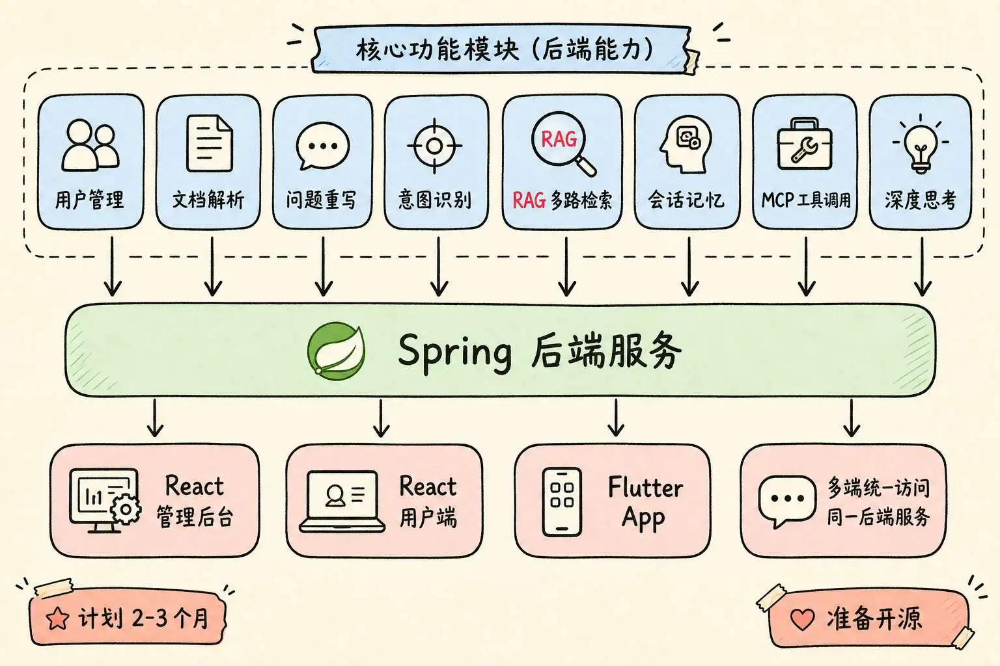
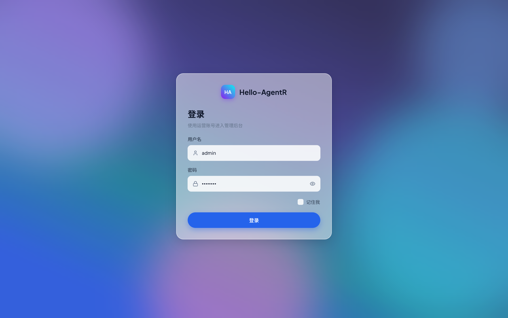
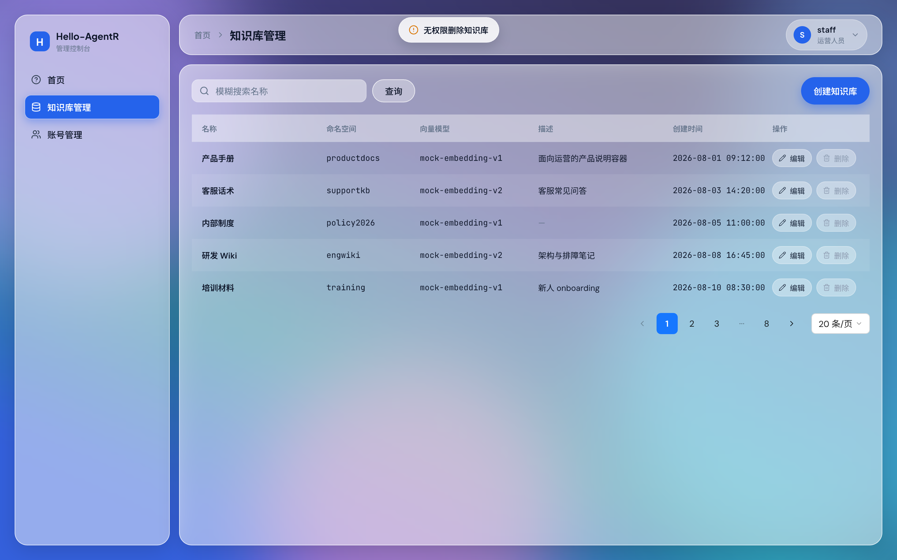

# Hello-AgentR

## 项目介绍

**功能上打算做全：**

- 用户管理、文档解析
- 用户问题重写、意图识别
- RAG多路检索、会话记忆
- MCP工具调用、深度思考

**支持四端：**

- Spring后端服务
- React管理后台 + 用户端
- Flutter移动端App

## 项目进度 8%

管理后台

- 登录
- 账号管理
- 知识库管理

## 公众号

后面会持续更新项目进展、技术踩坑、工作流优化，还有各种转型心得。如果你也在转型AI、或者对Agent开发感兴趣，欢迎关注我，一起交流成长。

[HelloAgent 工程手记1/100天——项目工作流搭建](https://mp.weixin.qq.com/s/q7Tx7CjK5cfmPRAkh96_Mg)

