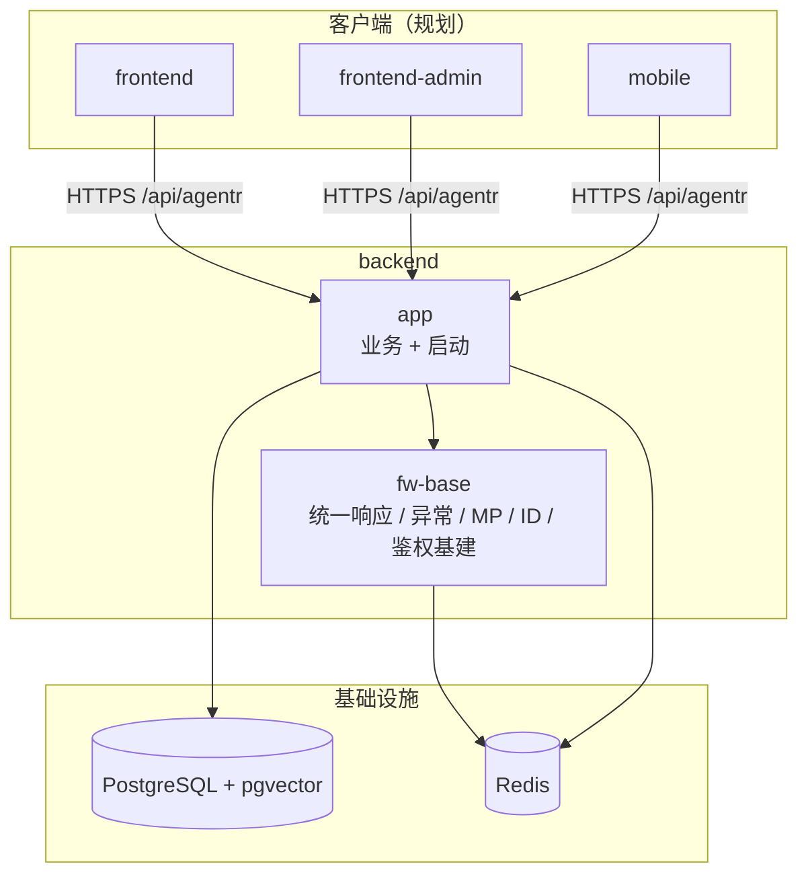

# 工程架构

> 最后更新：2026-08-04

## 项目总览

```text
backend/                                     # Spring Boot 后端（Maven 多模块 · Agentic RAG）
├── pom.xml                                  # 父 POM：依赖版本统一管理
├── fw-base/                                 # 基础框架：统一响应、异常、MyBatis-Plus、分布式 ID、鉴权基础设施
├── app/                                     # 可运行应用：业务包、启动类、application.yaml
├── lombok.config
├── mvnw / mvnw.cmd
└── .mvn/
```

### 后端 Maven 模块

| 模块        | artifactId     | 职责                                       |
| --------- | -------------- | ---------------------------------------- |
| 父工程       | `Hello-AgentR` | 多模块聚合、Java 21 / Spring Boot 版本与三方依赖 BOM  |
| `fw-base` | `fw-base`      | 跨业务共享基建：统一返回体、错误码与异常、全局异常处理、MyBatis-Plus 配置、Snowflake 分布式 ID、Redis / Sa-Token 依赖承载 |
| `app`     | `app`          | 业务实现与可执行入口；依赖 `fw-base`；持有 Web、PostgreSQL / pgvector 等运行时依赖 |

依赖方向：`app` → `fw-base`（单向；业务不得反向依赖）。

---

## 运行入口与运行时配置

### 启动类

| 项     | 说明                                       |
| ----- | ---------------------------------------- |
| 入口    | `com.xgc.agent.rag.HelloAgentRApplication` |
| 组件扫描  | `scanBasePackages = "com.xgc.agent.rag"`（业务包）；`fw-base` 位于 `com.xgc.agent.framework.base`，落地时需将扫描范围扩至可覆盖 framework（例如 `com.xgc.agent`） |
| 上下文路径 | `/api/agentr`                            |
| 默认端口  | `9898`                                   |

完整 API 前缀示例：`http://localhost:9898/api/agentr/...`

### 运行时依赖（本地）

| 组件         | 用途                                       | 配置位置                  |
| ---------- | ---------------------------------------- | --------------------- |
| PostgreSQL | 业务库（库名 `ragent`）+ pgvector 向量类型          | `spring.datasource.*` |
| Redis      | Sa-Token 会话、Snowflake worker/datacenter 分配、缓存与分布式能力 | `spring.data.redis.*` |

连接账号密码仅存放于本地 `application.yaml` / 环境变量，**勿写入文档或提交到公开仓库**。

### 上传限制

| 配置项                                      | 当前值     |
| ---------------------------------------- | ------- |
| `spring.servlet.multipart.max-file-size` | `50MB`  |
| `spring.servlet.multipart.max-request-size` | `100MB` |

---

## 后端工程结构

### 分层约定

业务按 **领域模块** 分包，新功能优先落在 `com.xgc.agent.rag.<module>/`，职责划分：

| 包 / 目录                       | 职责                        |
| ---------------------------- | ------------------------- |
| `controller`                 | HTTP 入口、参数校验、组装 `R<T>` 响应 |
| `service` / `service.impl`   | 用例编排、事务边界、领域规则            |
| `dao.entity`                 | 持久化实体（`*DO`）              |
| `dao.mapper`                 | MyBatis-Plus `BaseMapper` |
| `dto` / `vo`（按需）             | 请求/响应视图对象，与持久化实体解耦        |
| `resources/mapper/<module>/` | XML Mapper（复杂 SQL 时）      |

- `fw-base`（`com.xgc.agent.framework.base`）：跨业务共享，不含具体业务域逻辑。
- `app`：仅放业务与启动装配；基础设施能力优先复用 `fw-base`，避免在业务包重复造轮子。

代码生成约定见 `app` 模块测试侧 `CodeGenerator`：按 `MODULE` + 表名输出到同一业务包路径。

### 模块关系



**图例**：矩形 = 可部署/逻辑模块；圆柱 = 有状态存储；实线箭头 = 运行时依赖或调用。

**数据流摘要**：

1. **HTTP 入口**：客户端请求进入 `app` Controller → Service → Mapper / 外部能力。
2. **统一响应**：成功/失败均包装为 `R<T>`（`code` / `message` / `data` / `requestId`）；`code = "0"` 表示成功。
3. **异常通道**：业务抛出 `ClientException` / `ServerException` / `RemoteException`（均继承 `AbstractException`）→ `GlobalExceptionHandler` 转为 `R`；另覆盖参数校验、未登录、无角色、上传超限与兜底 `Throwable`。
4. **持久化**：MyBatis-Plus + PostgreSQL；分页插件按 `DbType.POSTGRE_SQL`；插入/更新自动填充 `createTime` / `updateTime` / `deleted`。
5. **分布式 ID**：启动时 `SnowflakeIdInitializer` 经 Redis Lua（`lua/snowflake_init.lua`）领取 `workerId` / `datacenterId`，注册 Hutool `Snowflake`；`MyBatisPlusIdentifierGenerator` 对接 `IdType.ASSIGN_ID`。
6. **鉴权基建**：Sa-Token + Redis 模板已引入；全局异常已映射未登录 / 无角色，业务侧鉴权注解与过滤器按域逐步接入。

### `backend/` 目录树（摘要）

```text
backend/
├── pom.xml                                 # 父 POM（Java 21、Spring Boot 3.5.x、依赖 BOM）
├── lombok.config                           # Lombok 与 Spring @Qualifier / Jacoco 约定
├── mvnw / mvnw.cmd
│
├── fw-base/
│   ├── pom.xml                             # hutool、MyBatis-Plus、Redis、Redisson、Sa-Token
│   └── src/main/
│       ├── java/com/xgc/agent/framework/base/
│       │   ├── result/R.java               # 统一返回体
│       │   ├── error/
│       │   │   ├── code/                   # IErrorCode、BaseErrorCode（C/S/T 类错误码）
│       │   │   └── exception/              # AbstractException、Client/Server/RemoteException
│       │   ├── web/GlobalExceptionHandler.java
│       │   ├── mybatisplus/                 # 分页、MetaObjectHandler
│       │   └── distributedid/              # Snowflake 初始化 + MP IdentifierGenerator
│       └── resources/lua/snowflake_init.lua
│
└── app/
    ├── pom.xml                             # 依赖 fw-base、web、postgresql、pgvector
    └── src/
        ├── main/
        │   ├── java/com/xgc/agent/rag/
        │   │   └── HelloAgentRApplication.java
        │   └── resources/application.yaml
        └── test/java/com/xgc/agent/rag/
            ├── BackendApplicationTests.java
            └── mybatisplus/                 # CodeGenerator、KnowledgeBaseDO/Mapper（探路样例）
```

### `fw-base` 共享能力摘要

| 模块                | 职责                            | 主要符号                                     |
| ----------------- | ----------------------------- | ---------------------------------------- |
| **result**        | 全局统一 API 返回                   | `R<T>`                                   |
| **error**         | 错误码与异常体系（用户端 / 系统 / 第三方）      | `BaseErrorCode`、`ClientException`、`ServerException`、`RemoteException` |
| **web**           | 全局异常到 `R` 的映射                 | `GlobalExceptionHandler`                 |
| **mybatisplus**   | PostgreSQL 分页、审计字段填充          | `MyBatisPlusConfig`、`MyBatisPlusMetaObjectHandler` |
| **distributedid** | Redis 协调的 Snowflake + MP 主键策略 | `SnowflakeIdInitializer`、`MyBatisPlusIdentifierGenerator` |

### 业务模块现状

| 模块                   | 状态       | 说明                                       |
| -------------------- | -------- | ---------------------------------------- |
| 启动与配置                | ✅ 已接入    | `HelloAgentRApplication`、`application.yaml`（端口 / 上下文 / PG / Redis / 上传） |
| `fw-base` 基建         | ✅ 已接入    | 统一响应、异常、MP、Snowflake、Sa-Token / Redis 依赖 |
| 知识库（探路）              | 🧪 测试侧样例 | `KnowledgeBaseDO` / `Mapper`、`CodeGenerator` 指向 `t_knowledge_base` 等表；正式业务包待迁入 `main` |
| RAG 检索 / Agent / MCP | ⏳ 未落地    | 产品定位见 `AGENTS.md`；按 OpenSpec 变更逐步推进      |

---

## 测试结构

测试位于 `app` 模块，包路径镜像业务包。

```text
app/src/test/java/com/xgc/agent/rag/
├── BackendApplicationTests.java            # 上下文加载、MP 探路查询
└── mybatisplus/
    ├── CodeGenerator.java                  # 按业务模块生成 entity/mapper/service（test scope）
    ├── KnowledgeBaseDO.java
    └── KnowledgeBaseMapper.java
```

**常用命令**：

```bash
cd backend
./mvnw -pl app -am test
```

---

## 三方组件与依赖

版本以父 POM `dependencyManagement` / `properties` 为准。

| 组件                                       | 状态     | 用途                           |
| ---------------------------------------- | ------ | ---------------------------- |
| Java 21                                  | ✅      | 语言与编译目标                      |
| Spring Boot 3.5.x                        | ✅      | 应用框架、Web、测试                  |
| spring-boot-starter-web                  | ✅      | HTTP API                     |
| MyBatis-Plus（spring-boot3-starter + jsqlparser） | ✅      | ORM、分页、逻辑删除、自动填充             |
| mybatis-plus-generator + Freemarker      | ✅ test | 按表生成代码（不入正式包）                |
| PostgreSQL JDBC                          | ✅      | 主库驱动                         |
| pgvector                                 | ✅      | PostgreSQL 向量类型支持            |
| Hutool                                   | ✅      | 工具集、Snowflake                |
| spring-boot-starter-data-redis           | ✅      | Redis 访问                     |
| Redisson                                 | ✅      | Redis 高级客户端（分布式能力预留）         |
| Sa-Token（spring-boot3-starter + redis-template） | ✅      | 登录态 / 权限基建                   |
| HikariCP                                 | ✅      | 连接池（Spring Boot 默认，yaml 已调参） |
| Lombok                                   | ✅      | 样板代码；见根目录 `lombok.config`    |
| JUnit                                    | ✅ test | 单元 / 集成测试                    |

---

## 变更记录

| 日期         | 说明                                       |
| ---------- | ---------------------------------------- |
| 2026-08-04 | 初稿：对齐当前 backend 多模块（`fw-base` + `app`）、分层约定、`fw-base` 能力表、依赖与启动说明 |
| 2026-08-04 | 项目总览仅保留 `backend/` 目录树                   |
| 2026-08-04 | 文档迁至 `docs/backend/工程架构.md` |
