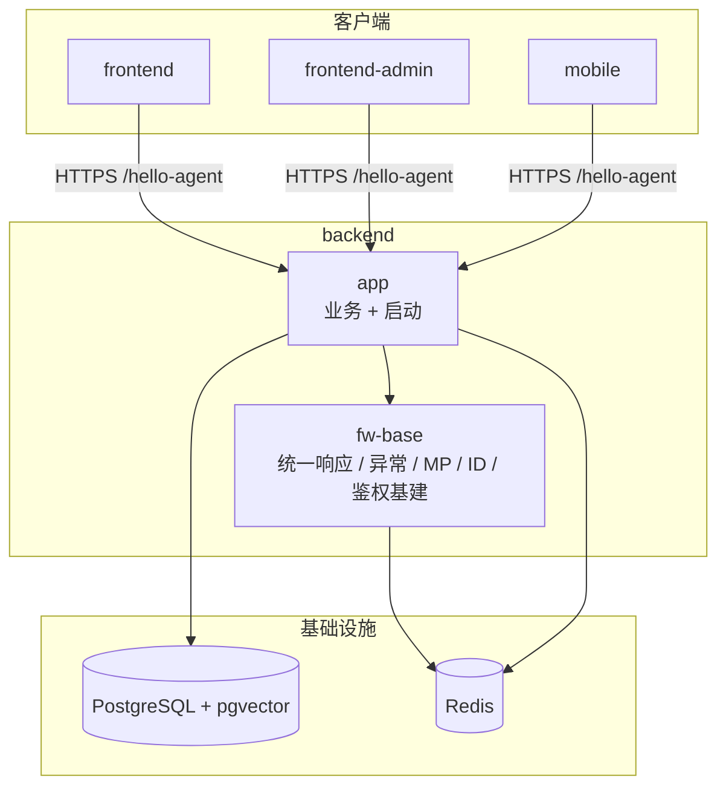

# 工程架构

> 最后更新：2026-08-09

## 项目总览

```text
backend/                                     # Spring Boot 后端（Maven 多模块 · Agentic RAG）
├── pom.xml                                  # 父 POM：依赖版本统一管理
├── fw-base/                                 # 基础框架：统一响应、异常、MyBatis-Plus、分布式 ID、鉴权基础设施
├── app/                                     # 可运行应用：业务包、启动类、application.yaml
├── lombok.config
├── mvnw / mvnw.cmd
└── .mvn/
```

### 后端 Maven 模块

| 模块        | artifactId    | 职责                                       |
| --------- | ------------- | ---------------------------------------- |
| 父工程       | `Hello-AgentR` | 多模块聚合、Java 17 / Spring Boot 版本与三方依赖 BOM  |
| `fw-base` | `fw-base`     | 跨业务共享基建：统一返回体、错误码与异常、全局异常处理、MyBatis-Plus 配置、Snowflake 分布式 ID、Redis / Sa-Token 依赖承载 |
| `app`     | `app`         | 业务实现与可执行入口；依赖 `fw-base`；持有 Web、PostgreSQL / pgvector、Validation、BCrypt 等运行时依赖 |

依赖方向：`app` → `fw-base`（单向；业务不得反向依赖）。

---

## 运行入口与运行时配置

### 启动类

| 项     | 说明                                       |
| ----- | ---------------------------------------- |
| 入口    | `com.xgc.agent.rag.HelloAgentApplication` |
| 组件扫描  | `scanBasePackages = "com.xgc.agent"`（覆盖业务包 `com.xgc.agent.rag` 与 `fw-base` 的 `com.xgc.agent.framework.base`） |
| 上下文路径 | `/hello-agent`                           |
| 默认端口  | `9898`                                   |

完整 API 前缀示例：`http://localhost:9898/hello-agent/...`  
契约详见 [api.md](api.md)。

### 运行时依赖（本地）

| 组件         | 用途                                       | 配置位置                  |
| ---------- | ---------------------------------------- | --------------------- |
| PostgreSQL | 业务库（库名 `hello-agent`）+ pgvector 向量类型     | `spring.datasource.*` |
| Redis      | Sa-Token 会话、Snowflake worker/datacenter 分配、缓存与分布式能力 | `spring.data.redis.*` |

连接账号密码仅存放于本地 `application.yaml` / 环境变量，**勿写入文档或提交到公开仓库**。变量说明见 [环境变量清单](环境变量清单.md)。

### 建表与迁移

项目**不使用 Flyway / Liquibase**。DDL 以手工 SQL 维护，部署前在目标库执行：

```bash
psql -h "$DB_HOST" -U "$DB_USERNAME" -d hello-agent -f backend/app/src/main/resources/db/t_admin_user.sql
psql -h "$DB_HOST" -U "$DB_USERNAME" -d hello-agent -f backend/app/src/main/resources/db/t_knowledge_base.sql
```

---

## 后端工程结构

### 分层约定

业务按 **领域模块** 分包，新功能优先落在 `com.xgc.agent.rag.<module>/`，职责划分：

| 包 / 目录                       | 职责                        |
| ---------------------------- | ------------------------- |
| `controller`                 | HTTP 入口、参数校验、组装 `R<T>` 响应 |
| `service` / `service.impl`   | 用例编排、事务边界、领域规则            |
| `dao.entity`                 | 持久化实体（`*DO`）              |
| `dao.mapper`                 | MyBatis-Plus `BaseMapper` |
| `dto`（按需）                    | 请求/响应视图对象，与持久化实体解耦        |
| `config`                     | 本域 Web / 鉴权拦截等装配          |
| `resources/db/`              | 手工 DDL 脚本                 |
| `resources/mapper/<module>/` | XML Mapper（复杂 SQL 时）      |

- `fw-base`（`com.xgc.agent.framework.base`）：跨业务共享，不含具体业务域逻辑。
- `app`：仅放业务与启动装配；基础设施能力优先复用 `fw-base`，避免在业务包重复造轮子。
- 持久化：**Service 直接注入 Mapper**（`Wrappers.lambdaQuery`），不另建 Repository 包装层。
- 代码生成约定见 `app` 模块测试侧 `CodeGenerator`：按 `MODULE` + 表名输出到同一业务包路径。

### 模块关系



**图例**：矩形 = 可部署/逻辑模块；圆柱 = 有状态存储；实线箭头 = 运行时依赖或调用。

**数据流摘要**：

1. **HTTP 入口**：客户端请求进入 `app` Controller → Service → Mapper / 外部能力。
2. **统一响应**：成功/失败均包装为 `R<T>`（`code` / `message` / `data` / `requestId`）；`code = "0"` 表示成功。
3. **异常通道**：业务按端抛出 `WebUserException` / `WebAdminException` / `MobileException`，系统与远程分别为 `ServerException` / `RemoteException`（均继承 `AbstractException`）→ `GlobalExceptionHandler` 转为 `R`；另覆盖参数校验、未登录、无角色、上传超限与兜底 `Throwable`。框架层未登录等按路径归入一级码：`/admin` → `A000001`，`/mobile` → `M000001`，其余 → `U000001`。
4. **持久化**：MyBatis-Plus + PostgreSQL；分页插件按 `DbType.POSTGRE_SQL`；插入/更新自动填充 `createTime` / `updateTime`。AdminUser **物理删除**（实体无 `@TableLogic`）。
5. **分布式 ID**：启动时 `SnowflakeIdInitializer` 经 Redis Lua（`lua/snowflake_init.lua`）领取 `workerId` / `datacenterId`，注册 Hutool `Snowflake`；`MyBatisPlusIdentifierGenerator` 对接 `IdType.ASSIGN_ID`。
6. **鉴权**：Sa-Token + Redis；管理端使用独立 `loginType=admin`（`StpAdminUtil`）。`AdminSaTokenConfig` 拦截 `/admin/**`（排除 `/admin/auth/login`）。写操作在 Service 内按角色能力矩阵校验（`requireAdmin`）。

### `backend/` 目录树（摘要）

```text
backend/
├── pom.xml                                 # 父 POM（Java 17、Spring Boot 3.5.x、依赖 BOM）
├── lombok.config
├── mvnw / mvnw.cmd
│
├── fw-base/
│   ├── pom.xml                             # hutool、MyBatis-Plus、Redis、Redisson、Sa-Token
│   └── src/main/
│       ├── java/com/xgc/agent/framework/base/
│       │   ├── result/R.java               # 统一返回体
│       │   ├── error/
│       │   │   ├── code/                   # IErrorCode、BaseErrorCode（S/T/U/A/M）
│       │   │   └── exception/              # AbstractException、WebUser/WebAdmin/Mobile/Server/Remote
│       │   ├── web/GlobalExceptionHandler.java
│       │   ├── config/                     # WebAutoConfiguration、MyBatisPlusConfig
│       │   ├── mybatisplus/                # MetaObjectHandler
│       │   ├── redis/                      # RedisKeySerializer
│       │   └── distributedid/              # Snowflake 初始化 + MP IdentifierGenerator
│       └── resources/lua/snowflake_init.lua
│
└── app/
    ├── pom.xml                             # 依赖 fw-base、web、postgresql、pgvector、validation、crypto
    └── src/
        ├── main/
        │   ├── java/com/xgc/agent/rag/
        │   │   ├── HelloAgentApplication.java
        │   │   ├── config/WebConfig.java   # UTF-8 消息转换、CORS
        │   │   ├── admin/                  # 管理端身份与账号
        │   │   │   ├── controller/         # Auth / Users HTTP 入口
        │   │   │   ├── service/ + impl/
        │   │   │   ├── dao/entity + mapper/
        │   │   │   ├── dto/
        │   │   │   ├── auth/StpAdminUtil.java
        │   │   │   ├── config/AdminSaTokenConfig.java
        │   │   │   ├── bootstrap/BootstrapAdminInitializer.java
        │   │   │   ├── error/AdminErrorCode.java
        │   │   │   └── util/               # 凭证规则、BCrypt
        │   │   └── knowledge/              # 知识库容器（V0.2）
        │   │       ├── controller/         # KB CRUD + 模拟目录
        │   │       ├── service/ + impl/
        │   │       ├── dao/entity + mapper/
        │   │       ├── dto/
        │   │       ├── error/KnowledgeErrorCode.java
        │   │       └── util/KnowledgeFieldRules.java
        │   └── resources/
        │       ├── application.yaml
        │       └── db/                     # t_admin_user.sql、t_knowledge_base.sql
        └── test/java/com/xgc/agent/rag/
            ├── BackendApplicationTests.java
            ├── admin/                      # 凭证规则 + 持久化 + 认证/治理 IT
            ├── knowledge/                  # 字段规则 + 占用打桩 + 持久化/API IT
            └── mybatisplus/                # CodeGenerator、探路样例（非正式规格）
```

### `fw-base` 共享能力摘要

| 模块                | 职责                            | 主要符号                                     |
| ----------------- | ----------------------------- | ---------------------------------------- |
| **result**        | 全局统一 API 返回                   | `R<T>`                                   |
| **error**         | 错误码与按端异常体系（S/T/U/A/M）         | `BaseErrorCode`、`WebUserException`、`WebAdminException`、`MobileException`、`ServerException`、`RemoteException` |
| **web**           | 全局异常到 `R` 的映射                 | `GlobalExceptionHandler`                 |
| **mybatisplus**   | PostgreSQL 分页、审计字段填充          | `MyBatisPlusConfig`、`MyBatisPlusMetaObjectHandler` |
| **distributedid** | Redis 协调的 Snowflake + MP 主键策略 | `SnowflakeIdInitializer`、`MyBatisPlusIdentifierGenerator` |
| **redis**         | Redis key 前缀序列化               | `RedisKeySerializer`                     |

### 业务模块现状

| 模块                   | 状态       | 说明                                       |
| -------------------- | -------- | ---------------------------------------- |
| 启动与配置                | ✅ 已接入    | `HelloAgentApplication`、`application.yaml`（端口 / 上下文 / PG / Redis / 上传 / Sa-Token）、`WebConfig`（UTF-8 / CORS） |
| `fw-base` 基建         | ✅ 已接入    | 统一响应、按端错误码与异常、MP、Snowflake、Sa-Token / Redis |
| 管理端身份与账号 `admin`     | ✅ V0.1   | 登录 / 登出 / me / 改己密；AdminUser 列表 / 创建 / 重置密码 / 改角色 / 物理删除；Bootstrap 初始化；`loginType=admin` 拦截器。详见 [版本更新](版本迭代/版本更新.md)、[api.md](api.md) |
| 知识库容器 `knowledge`     | ✅ V0.2   | KnowledgeBase CRUD、Namespace / EmbeddingModel 绑定、模拟目录；无 Document / 索引。见 [api.md](api.md)、[V0.2 PRD](版本迭代/V0.2/prd.md) |
| RAG 检索 / Agent / MCP | ⏳ 未落地    | 产品定位见 `AGENTS.md`；按 OpenSpec 变更逐步推进      |

---

## 测试结构

测试位于 `app` 模块，包路径镜像业务包。

```text
app/src/test/java/com/xgc/agent/rag/
├── BackendApplicationTests.java            # 上下文加载、MP 探路查询
├── admin/
│   ├── AdminCredentialRulesTest.java       # 用户名/密码规则与 BCrypt
│   ├── AdminUserPersistenceIT.java         # Mapper 装配（依赖本地 PG）
│   └── AdminAuthAndUserIT.java             # 认证 + 账号治理集成（依赖本地 PG + Redis）
├── knowledge/
│   ├── KnowledgeFieldRulesTest.java
│   ├── KnowledgeBaseServiceImplTest.java   # Document 占用打桩
│   ├── KnowledgeBasePersistenceIT.java
│   └── KnowledgeBaseIT.java
└── mybatisplus/
    ├── CodeGenerator.java
    ├── ProbeKnowledgeBaseDO.java           # 探路样例，非正式规格
    └── ProbeKnowledgeBaseMapper.java       # 无 @Mapper，避免与正式 Mapper 撞名
```

**常用命令**：

```bash
cd backend
./mvnw -pl app -am test
./mvnw -pl app -am test -Dtest=AdminCredentialRulesTest,AdminUserPersistenceIT,AdminAuthAndUserIT,KnowledgeFieldRulesTest,KnowledgeBaseServiceImplTest,KnowledgeBasePersistenceIT,KnowledgeBaseIT -Dsurefire.failIfNoSpecifiedTests=false
```

---

## 三方组件与依赖

版本以父 POM `dependencyManagement` / `properties` 为准。

| 组件                                       | 状态     | 用途                            |
| ---------------------------------------- | ------ | ----------------------------- |
| Java 17                                  | ✅      | 语言与编译目标（父 POM `java.version`） |
| Spring Boot 3.5.x                        | ✅      | 应用框架、Web、测试                   |
| spring-boot-starter-web                  | ✅      | HTTP API                      |
| spring-boot-starter-validation           | ✅      | 请求体 `@Valid`                  |
| spring-security-crypto                   | ✅      | BCrypt 密码哈希（不引入 security-web） |
| MyBatis-Plus（spring-boot3-starter + jsqlparser） | ✅      | ORM、分页、自动填充                   |
| mybatis-plus-generator + Freemarker      | ✅ test | 按表生成代码（不入正式包）                 |
| PostgreSQL JDBC                          | ✅      | 主库驱动                          |
| pgvector                                 | ✅      | PostgreSQL 向量类型支持             |
| Hutool                                   | ✅      | 工具集、Snowflake                 |
| spring-boot-starter-data-redis           | ✅      | Redis 访问                      |
| Redisson                                 | ✅      | Redis 高级客户端（分布式能力预留）          |
| Sa-Token（spring-boot3-starter + redis-template） | ✅      | 登录态；管理端独立 `loginType=admin`   |
| HikariCP                                 | ✅      | 连接池（Spring Boot 默认，yaml 已调参）  |
| Lombok                                   | ✅      | 样板代码；见根目录 `lombok.config`     |
| JUnit                                    | ✅ test | 单元 / 集成测试                     |

---

## 变更记录

| 日期         | 说明                                       |
| ---------- | ---------------------------------------- |
| 2026-08-04 | 初稿：对齐 backend 多模块（`fw-base` + `app`）、分层约定、`fw-base` 能力表、依赖与启动说明 |
| 2026-08-04 | 项目总览仅保留 `backend/` 目录树                   |
| 2026-08-04 | 文档迁至 `docs/backend/工程架构.md`              |
| 2026-08-07 | 上下文路径统一为 `/hello-agent`                  |
| 2026-08-09 | 对齐 V0.1：启动类、库名、错误码按端拆分、`admin` 模块、Sa-Token 拦截器、手工 DDL、测试与依赖表 |
