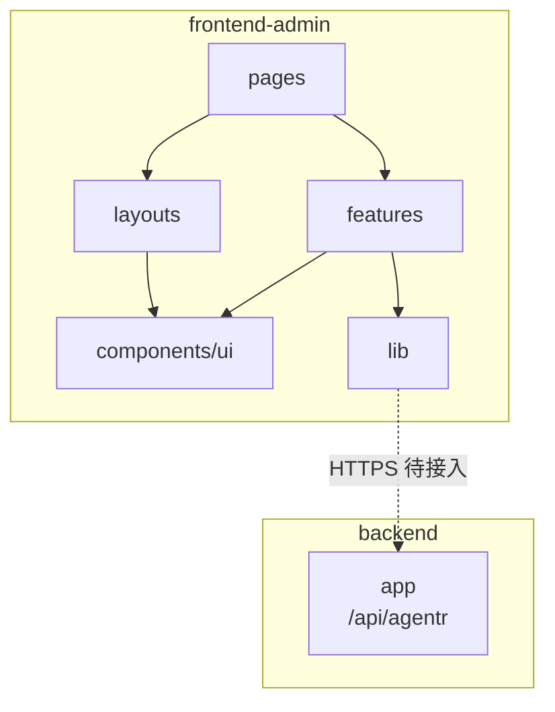

# 工程架构

> 最后更新：2026-08-07

## 项目总览

```text
frontend-admin/                              # Web 管理后台（Vite + React + TypeScript）
├── index.html                               # HTML 入口
├── package.json                             # 依赖与脚本（npm）
├── vite.config.ts                           # Vite / Tailwind / Vitest / 路径别名
├── tsconfig*.json                           # TypeScript 工程引用（strict）
├── eslint.config.js                         # ESLint flat config
├── .prettierrc.json                         # Prettier（含 Tailwind class 排序）
├── public/                                  # 静态资源
└── src/                                     # 应用源码
```

### 工程定位

| 项    | 说明                                       |
| ---- | ---------------------------------------- |
| 目录   | 仓库根下独立前端子项目 `frontend-admin/`（非 monorepo workspace） |
| 职责   | 面向运营 / 管理侧的 Web 控制台；对接后端 `backend` 的 HTTP API |
| 包管理  | npm（`package-lock.json`）                 |
| 构建   | Vite；开发与生产均由 Vite 打包                     |

与后端关系：管理后台作为客户端之一，经 HTTPS 调用 `backend` 的 `/api/agentr`（契约与鉴权接入待定）。

---

## 运行入口与运行时配置

### 启动入口

| 项      | 说明                                       |
| ------ | ---------------------------------------- |
| HTML   | `index.html` → `/src/main.tsx`           |
| 应用根    | `src/main.tsx`：`StrictMode` + 挂载 `App`   |
| 路由根    | `src/App.tsx`：`createBrowserRouter` + `RouterProvider` |
| 默认开发地址 | `http://localhost:5173/`（Vite 默认端口）      |
| 路径别名   | `@` → `src/`（`vite.config.ts` 与 `tsconfig.app.json`） |

### 常用命令

```bash
cd frontend-admin
npm install
npm run dev       # 本地开发
npm run build     # tsc -b + 生产构建
npm run preview   # 预览生产包
npm run lint      # ESLint
npm run format    # Prettier
npm run test      # Vitest
```

### 运行时依赖（本地）

| 组件                        | 用途         | 状态                     |
| ------------------------- | ---------- | ---------------------- |
| Node.js + npm             | 安装与脚本      | 必需                     |
| Vite Dev Server           | HMR / 静态服务 | 开发必需                   |
| backend（`localhost:9898`） | 业务 API     | **待对接**；当前空工程不依赖后端即可启动 |

环境变量、API Base、Sa-Token 会话策略等在后端契约明确后补充（勿将密钥写入文档或提交仓库）。

---

## 前端工程结构

### 分层约定

源码按 **页面 / 领域功能 / 无业务 UI / 共享基建** 划分。空工程仅落地最小子集；扩展时优先遵循下表，依赖方向：

**`pages` → `features` → `lib` / `components/ui`**（`features` 之间避免深耦合）。

| 目录                       | 职责                                       | 现状                    |
| ------------------------ | ---------------------------------------- | --------------------- |
| `src/pages/`             | 路由级页面：编排布局与 features，保持薄                 | ✅ 占位 `HomePage`       |
| `src/features/<domain>/` | 按业务域：`api.ts` / `types.ts` / `hooks.ts` / `copy.ts` | ⏳ 未建                  |
| `src/components/ui/`     | 无业务语义的自研基座组件                             | ⏳ 未建                  |
| `src/layouts/`           | 壳层布局（侧栏、顶栏等）                             | ⏳ 未建                  |
| `src/lib/`               | `apiClient`、`queryClient`、`cn`、storage 等 | ⏳ 未建                  |
| `src/routes/`            | 路由表集中定义、鉴权 guard / loader                | ⏳ 约定在 `App.tsx`；后续可拆出 |
| `src/styles/`            | 全局样式；Tailwind `@import` / 后续 `@theme`    | ✅ `global.css`        |

样式约定：以 **Tailwind CSS v4** 为主；重复模式抽到 `components/ui` 或 `@utility`，不以 CSS Modules / CSS-in-JS 作主方案。

### 模块关系



**图例**：实线 = 源码依赖方向；虚线 = 规划中的运行时调用。

**数据流摘要（目标态，待实现）**：

1. **路由**：`react-router` Data Router 匹配页面；后续加登录守卫。
2. **服务端状态**：页面 / features 经 TanStack Query 拉取列表与详情，变更后 `invalidate`。
3. **客户端状态**：会话、侧栏、toast 等放 Zustand（或等价轻量方案）。
4. **HTTP**：`lib/apiClient` 薄封装 `fetch`，对齐后端统一返回体 `R<T>` 与鉴权头 / Cookie。
5. **表单**：`react-hook-form` + `zod` 校验，schema 可与请求 DTO 共用。

### `frontend-admin/` 目录树（摘要）

```text
frontend-admin/
├── index.html
├── package.json / package-lock.json
├── vite.config.ts                          # @vitejs/plugin-react、@tailwindcss/vite、alias @、vitest
├── tsconfig.json                           # project references
├── tsconfig.app.json                       # 应用 TS（strict、paths）
├── tsconfig.node.json                      # Node 侧配置（vite.config）
├── eslint.config.js
├── .prettierrc.json / .prettierignore
├── public/
│   ├── favicon.svg
│   └── icons.svg
└── src/
    ├── main.tsx                            # 入口 + StrictMode
    ├── App.tsx                             # RouterProvider（/ 与 * → HomePage）
    ├── styles/global.css                   # @import "tailwindcss"
    └── pages/
        ├── HomePage.tsx                    # 占位首页
        └── HomePage.test.tsx               # 冒烟测试
```

### 业务与基建现状

| 模块             | 状态    | 说明                                       |
| -------------- | ----- | ---------------------------------------- |
| 工程脚手架          | ✅ 已接入 | Vite + React 19 + TypeScript strict + Tailwind v4 |
| 路由占位           | ✅ 已接入 | 仅首页；无鉴权                                  |
| 技术栈依赖预装        | ✅ 已安装 | Query / Zustand / RHF / zod / lucide 等，业务代码未用 |
| 自研 UI          | ⏳ 未落地 | 待视觉确定                                    |
| API / Sa-Token | ⏳ 未落地 | 待后端契约与 OpenSpec 变更                       |
| 领域 features    | ⏳ 未落地 | 按版本迭代 / OpenSpec 逐步推进                    |

---

## 测试结构

测试与源码同树放置（`*.test.tsx`），Vitest + Testing Library，环境 `jsdom`（见 `vite.config.ts`）。

```text
src/pages/
└── HomePage.test.tsx                       # 占位页冒烟
```

**常用命令**：

```bash
cd frontend-admin
npm run test
```

生产构建前会执行 `tsc -b`（`npm run build`），CI 建议同步跑 `npm run lint` 与 `npm run test`。

---

## 三方组件与依赖

版本以 `package.json` / lockfile 为准（下表为当前锁定意图，非逐号钉死）。

### 运行时

| 组件                    | 状态   | 用途                  |
| --------------------- | ---- | ------------------- |
| React 19 / react-dom  | ✅    | UI 运行时              |
| react-router          | ✅    | Data Router 路由      |
| @tanstack/react-query | ✅ 预装 | 服务端状态（待业务使用）        |
| zustand               | ✅ 预装 | 客户端全局状态（待业务使用）      |
| react-hook-form + zod | ✅ 预装 | 表单与 schema 校验       |
| lucide-react          | ✅ 预装 | 图标                  |
| clsx + tailwind-merge | ✅ 预装 | 条件 class（后续 `cn()`） |

### 工程与质量

| 组件                                       | 状态   | 用途        |
| ---------------------------------------- | ---- | --------- |
| Vite 8                                   | ✅    | 开发服务器与打包  |
| TypeScript 6（strict）                     | ✅    | 类型检查      |
| Tailwind CSS 4 + `@tailwindcss/vite`     | ✅    | 样式        |
| ESLint + typescript-eslint + react-hooks / react-refresh | ✅    | 静态检查      |
| Prettier + prettier-plugin-tailwindcss   | ✅    | 格式化       |
| Vitest + Testing Library + jsdom         | ✅    | 单元 / 组件测试 |

## 变更记录

| 日期         | 说明                                  |
| ---------- | ----------------------------------- |
| 2026-08-07 | 初稿：对齐空工程脚手架、分层约定、依赖与启动说明；扩展目录标注为待落地 |
