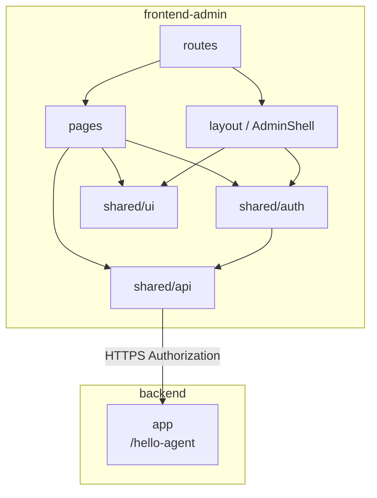

# 工程架构

> 最后更新：2026-08-09

## 项目总览

```text
frontend-admin/                              # Web 管理后台（Vite + React + TypeScript）
├── index.html                               # HTML 入口
├── package.json                             # 依赖与脚本（npm）
├── vite.config.ts                           # Vite / Tailwind / Vitest / 路径别名 / 开发代理
├── tsconfig*.json                           # TypeScript 工程引用（strict）
├── eslint.config.js                         # ESLint flat config
├── .prettierrc.json                         # Prettier（含 Tailwind class 排序）
├── .env.example                             # VITE_API_BASE_URL 示例
├── public/                                  # 静态资源
└── src/                                     # 应用源码
```

### 工程定位

| 项    | 说明                                       |
| ---- | ---------------------------------------- |
| 目录   | 仓库根下独立前端子项目 `frontend-admin/`（非 monorepo workspace） |
| 职责   | 面向运营 / 管理侧的 Web 控制台；对接后端 `backend` 的 HTTP API |
| 包管理  | npm（`package-lock.json`）                 |
| 构建   | Vite；开发与生产均由 Vite 打包                     |

与后端关系：经 HTTPS 调用 `backend` 的 `/hello-agent`。开发时 Vite 将 `/hello-agent` 代理到 `http://127.0.0.1:9898`。契约见 [`docs/backend/api.md`](../backend/api.md)。

---

## 运行入口与运行时配置

### 启动入口

| 项      | 说明                                       |
| ------ | ---------------------------------------- |
| HTML   | `index.html` → `/src/main.tsx`           |
| 应用根    | `src/main.tsx`：`StrictMode` + 挂载 `App`   |
| 路由根    | `src/App.tsx`：`createBrowserRouter` + `RouterProvider` + Ant Design `ConfigProvider` |
| 默认开发地址 | `http://localhost:5173/`（Vite 默认端口）      |
| 路径别名   | `@` → `src/`（`vite.config.ts` 与 `tsconfig.app.json`） |
| API 前缀 | `VITE_API_BASE_URL`（本地示例 `/hello-agent`，走 Vite proxy） |

### 常用命令

```bash
cd frontend-admin
npm install
npm run dev       # 本地开发
npm run build     # tsc -b + 生产构建
npm run preview   # 预览生产包
npm run lint      # ESLint
npm run format    # Prettier
npm run test      # Vitest
```

### 运行时依赖（本地）

| 组件                        | 用途         | 状态                                     |
| ------------------------- | ---------- | -------------------------------------- |
| Node.js + npm             | 安装与脚本      | 必需                                     |
| Vite Dev Server           | HMR / 静态服务 | 开发必需                                   |
| backend（`localhost:9898`） | 业务 API     | V0.1 登录与账号治理已对接；本地需 PostgreSQL + Redis |

环境变量模板：`.env.example`。勿将密钥写入文档或提交仓库。Token 存 **localStorage**（见 [ADR-0002](../adr/0002-admin-console-token-in-localstorage.md)）。

---

## 前端工程结构

### 分层约定

源码按 **页面 / 壳层 / 路由守卫 / 共享基建** 划分。依赖方向：

**`pages` / `layout` → `shared`（api / auth / ui / lib）**；页面之间避免互引。

| 目录                 | 职责                                       | 现状             |
| ------------------ | ---------------------------------------- | -------------- |
| `src/pages/`       | 路由级页面：登录、首页占位、账号管理及行内模态                  | ✅ V0.1         |
| `src/layout/`      | Admin Shell：侧栏、顶栏、改己密模态                  | ✅              |
| `src/routes/`      | `RequireAuth` / `GuestOnly`              | ✅              |
| `src/shared/api/`  | `apiClient`、`auth` / `users` API、`R<T>` 类型 | ✅              |
| `src/shared/auth/` | localStorage token、记住用户名、Zustand 会话      | ✅              |
| `src/shared/ui/`   | Toast、分页、Select 等无业务语义组件                 | ✅ 部分           |
| `src/shared/lib/`  | 校验规则、展示格式化                               | ✅              |
| `src/styles/`      | 全局样式；Tailwind `@import`                  | ✅ `global.css` |

样式约定：以 **Tailwind CSS v4** 为主，Ant Design 提供部分表单/配置能力；重复模式抽到 `shared/ui`。

### 路由

| 路径       | 守卫                           | 页面          |
| -------- | ---------------------------- | ----------- |
| `/login` | `GuestOnly`（已登录则进首页）         | `LoginPage` |
| `/`      | `RequireAuth` + `AdminShell` | `HomePage`  |
| `/users` | 同上                           | `UsersPage` |

启动时用本地 token 调 `/admin/auth/me` 恢复会话；未登录码 `A000001` 清会话并跳转登录页。

### 模块关系



**图例**：实线 = 源码依赖或运行时调用。

**数据流摘要**：

1. **路由**：Data Router；匿名仅登录页，受保护页包在 `AdminShell` 内。
2. **会话**：Zustand `session-store`；token 读写 `localStorage`；`wireSessionToApiClient` 注入 Authorization。
3. **HTTP**：`shared/api/client.ts` 薄封装 `fetch`，对齐后端 `R<T>`（`code === "0"` 成功）。
4. **账号治理**：`UsersPage` 调 `/admin/users*`；创建 / 编辑 / 删除为当前页模态；Staff 写入口灰显，以后端鉴权为准。
5. **反馈**：字段内联校验；业务失败展示后端 `message`；成功 / 全局错误用 Toast。

### `frontend-admin/` 目录树（摘要）

```text
frontend-admin/
├── index.html
├── package.json / package-lock.json
├── vite.config.ts                          # react、tailwind、alias @、proxy /hello-agent、vitest
├── tsconfig*.json
├── eslint.config.js
├── .prettierrc.json / .prettierignore
├── .env.example                            # VITE_API_BASE_URL=/hello-agent
├── public/
└── src/
    ├── main.tsx
    ├── App.tsx                             # 路由 + Ant Design + ToastHost
    ├── styles/global.css
    ├── layout/                             # AdminShell、Sidebar、Topbar、ChangePasswordModal
    ├── routes/                             # RequireAuth、GuestOnly
    ├── pages/
    │   ├── LoginPage.tsx
    │   ├── HomePage.tsx
    │   └── users/                          # UsersPage + Create/Edit/Delete 模态
    └── shared/
        ├── api/                            # client、auth、users、types
        ├── auth/                           # storage、session-store、remember-username
        ├── ui/                             # Toast、Pagination、SelectMenu
        └── lib/                            # validation、display
```

### 业务与基建现状

| 模块            | 状态     | 说明                                       |
| ------------- | ------ | ---------------------------------------- |
| 工程脚手架         | ✅ 已接入  | Vite + React 19 + TypeScript strict + Tailwind v4 |
| 登录 / 登出 / 改己密 | ✅ V0.1 | 记住用户名；改密成功清会话并回登录页                       |
| 管理壳层          | ✅ V0.1 | 侧栏：首页 / 账号管理；顶栏：身份、改密、登出                 |
| 首页占位          | ✅ V0.1 | 无业务内容                                    |
| 账号管理          | ✅ V0.1 | 列表分页筛选；创建 / 重置密码 / 改角色 / 删除（模态）          |
| API / 会话      | ✅ V0.1 | `Authorization` + localStorage；对齐 `R<T>` |
| RAG / 其它业务页   | ⏳ 未落地  | 按版本迭代 / OpenSpec 逐步推进                    |

屏态与交互边界见 [CONTEXT.md](CONTEXT.md)；版本归档见 [版本更新](版本迭代/版本更新.md)。

---

## 测试结构

测试与源码同树放置（`*.test.tsx` / `*.test.ts`），Vitest + Testing Library，环境 `jsdom`（见 `vite.config.ts`）。测试环境注入 `VITE_API_BASE_URL`。

```text
src/
├── pages/LoginPage.test.tsx
├── pages/HomePage.test.tsx
├── pages/users/UsersPage.test.tsx
├── layout/AdminShell.test.tsx
├── layout/ChangePasswordModal.test.tsx
├── routes/auth-guards.test.tsx
└── shared/
    ├── api/client.test.ts
    ├── api/users.test.ts
    ├── api/auth.extra.test.ts
    └── ui/toast.test.tsx
```

**常用命令**：

```bash
cd frontend-admin
npm run test
```

生产构建前会执行 `tsc -b`（`npm run build`），CI 建议同步跑 `npm run lint` 与 `npm run test`。

---

## 三方组件与依赖

版本以 `package.json` / lockfile 为准。

### 运行时

| 组件                    | 状态   | 用途                      |
| --------------------- | ---- | ----------------------- |
| React 19 / react-dom  | ✅    | UI 运行时                  |
| react-router          | ✅    | Data Router 路由          |
| zustand               | ✅    | 会话等客户端状态                |
| antd                  | ✅    | ConfigProvider / 部分表单控件 |
| lucide-react          | ✅    | 图标                      |
| clsx + tailwind-merge | ✅    | 条件 class                |
| @tanstack/react-query | 预装   | 服务端状态（V0.1 主路径未强制使用）    |
| react-hook-form + zod | 预装   | 表单与 schema（可按页选用）       |

### 工程与质量

| 组件                                       | 状态   | 用途        |
| ---------------------------------------- | ---- | --------- |
| Vite 8                                   | ✅    | 开发服务器与打包  |
| TypeScript 6（strict）                     | ✅    | 类型检查      |
| Tailwind CSS 4 + `@tailwindcss/vite`     | ✅    | 样式        |
| ESLint + typescript-eslint + react-hooks / react-refresh | ✅    | 静态检查      |
| Prettier + prettier-plugin-tailwindcss   | ✅    | 格式化       |
| Vitest + Testing Library + jsdom         | ✅    | 单元 / 组件测试 |

## 变更记录

| 日期         | 说明                                |
| ---------- | --------------------------------- |
| 2026-08-07 | 初稿：对齐空工程脚手架、分层约定、依赖与启动说明          |
| 2026-08-09 | 对齐 V0.1：登录/壳层/账号管理、API 代理、会话与测试结构 |
