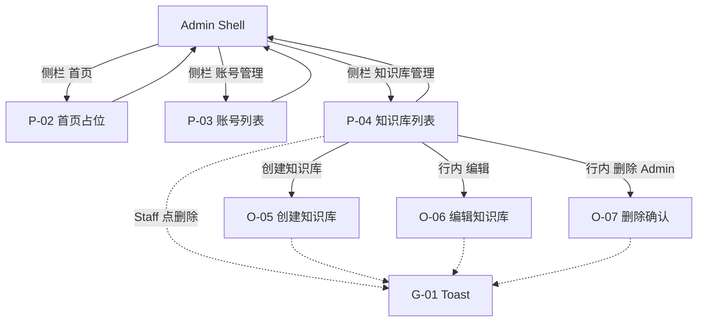

# 交互设计说明（IXD）：Web 管理端知识库容器治理

**状态**：草案 v1  
**关联 PRD**：[`prd.md`](./prd.md)（V0.2）  
**领域词汇**：[`docs/frontend-admin/CONTEXT.md`](../../CONTEXT.md)  
**视觉真源**：[`ui/知识库管理.pen`](./ui/知识库管理.pen)（**不以线框替代**；布局、控件、文案以该稿帧为准）  
**壳层 / 账号治理**：沿用 [`../v0.1/ixd.md`](../v0.1/ixd.md)，本文件只写 V0.2 增量与壳层导航差量  
**最后更新**：2026-08-11

---

## 1. 文档目的

将 PRD V0.2 的知识库列表、创建 / 改文案 / 删除，落实为可验收的交互规格：屏/态 ID、入口出口、手势结果、反馈与**已定稿文案**。帧命名与 Pencil 顶层帧一一对应，供实现对照，不另画 ASCII 线框。

---

## 2. 范围与设计原则（交互层；不扩 PRD scope）

**范围内**

- 管理壳层侧栏扩为三项，顺序见 §3（Pencil 定稿）
- 知识库列表：Name 模糊、分页；列见 Pencil 表头
- 创建 / 编辑 / 删除：挂在列表页的模态，无独立详情路由
- Admin / Staff 能力差：仅删除；Staff 创建与改文案可用
- 空列表、创建校验/冲突、目录不可用、删除业务失败、Toast

**范围外**（与 PRD / CONTEXT 一致）

- Document 上传 / 列表 / 删除、解析、切块、向量与索引状态
- 按 Namespace 筛选；修改 Namespace 或 EmbeddingModel
- 恢复已删除知识库；独立详情路由
- 列表中的文档数 / 切片数 / 索引状态等假字段
- 把模拟模型标识包装成生产模型名
- 账号治理行为变更（仍以 V0.1 为准，仅侧栏多项顺序随本稿）
- 视觉色值与组件实现细节（见 Pencil，不在本文复述）

**交互原则**

1. **视觉真源**：结构与文案以 `知识库管理.pen` 对应帧为准；实现应对帧，不自行发明列或入口。
2. **壳层稳定**：受保护页共用 Admin Shell；顶栏身份区（修改密码 / 登出）不改。
3. **写操作不另开路由**：创建 / 编辑 / 删除均为当前列表页 Overlay。
4. **权限表现与 V0.1 账号治理一致**：Staff 删除灰显仍可点，Toast 说明，不打开可提交的删除确认（见 §6，相对 PRD「禁用 + tooltip」的设计确认）。
5. **反馈分层**：字段规则用占位/内联；业务失败在弹窗内红条展示 `message`；成功与无权限用 Toast。

---

## 3. 信息架构

**主导航（侧栏，Pencil 顺序）**

| 项 | 目标 | 高亮 |
| -- | ---- | ---- |
| 首页 | P-02 | 在首页时 |
| 知识库管理 | P-04 | 在知识库列表及本页模态时 |
| 账号管理 | P-03 | 在账号列表及账号模态时 |

**顶栏身份下拉**（与 V0.1 相同）

| 项 | 目标 |
| -- | ---- |
| 修改密码 | O-04（见 V0.1 IXD） |
| 登出 | 清会话 → P-01 |

**路由意图**（逻辑；path 实现前由工程选定）

| 屏 | 路由 |
| -- | ---- |
| 知识库列表 | `/knowledge-bases` 或等价；需登录 |
| 创建 / 编辑 / 删除 | 无独立路由 |

---

## 4. 屏与态清单

与 Pencil 顶层帧名对齐。V0.1 已有帧（登录、账号 CRUD、改密）仍在同一 `.pen` 中，行为见 V0.1 IXD，本表不重复。

| ID | 前缀类型 | Pencil 帧名 | 挂载父级 | 入口 | 出口 |
| -- | -------- | ----------- | -------- | ---- | ---- |
| DS-00 | Design system | `DS-00 Design System` | — | 设计稿参考（含 Select / 只读字段 / Toast） | — |
| P-02 | Screen | `P-02 / H-01 Home Placeholder` | Shell | 登录成功默认；侧栏首页 | 侧栏 → P-04 / P-03 |
| P-04 | Screen | — | Shell | 侧栏「知识库管理」 | O-05 / O-06 / O-07；筛选分页 |
| H-01 | State | `P-04 / H-01 KnowledgeBase List Admin` | P-04 | Admin 进入列表且有数据 | 写操作可用 |
| H-02 | State | `P-04 / H-02 KnowledgeBase List Staff` | P-04 | Staff 进入列表且有数据 | 删除灰显可点 → Toast；创建/编辑可用 |
| H-03 | State | `P-04 / H-03 KnowledgeBase List Empty` | P-04 | 一条知识库都没有 | 创建入口仍可用 → O-05 |
| H-04 | State | `P-04 / H-04 KnowledgeBase List Filter Empty` | P-04 | Name 模糊查询无匹配 | 改关键词再查询；创建仍可用 → O-05 |
| O-05 | Overlay | `O-05 Create KnowledgeBase Modal` | P-04 | 页头「创建知识库」 | 取消/关闭；成功 → G-01 + 刷新 |
| O-05a | Overlay | `O-05a Create Validation Error` | P-04 | 提交后名称/Namespace 冲突等 | 弹窗不关；列表无新行 |
| O-05b | Overlay | `O-05b Create Catalog Failed` | P-04 | 模拟目录加载失败 | 「创建」禁用；不可提交 |
| O-06 | Overlay | `O-06 Edit KnowledgeBase Modal` | P-04 | 行内「编辑」 | 取消/关闭；成功 → Toast + 刷新 |
| O-07 | Overlay | `O-07 Delete KnowledgeBase Modal` | P-04 | Admin 行内「删除」 | 取消；确认成功 → Toast + 刷新 |
| O-07a | Overlay | `O-07a Delete Business Error` | P-04 | 确认删除后后端拒绝（如 `A002008`） | 弹窗不关；记录仍在 |
| G-01 | Global | `G-01 Toast Success` | 列表页上方居中 | 创建/更新/删除成功 | 自动消失 |

> Staff 无权限 Toast 画在 `P-04 / H-02` 帧顶栏下方（文案见 §5.3），与成功 Toast 同一出现位置约定。

---

## 5. 逐屏 / 逐态规格

以下「结构」只描述 Pencil 已画出的区块与文案，不附线框。实现时打开对应帧。

### 5.1 P-02 首页占位（壳层差量）

- **用户目标**：登录后落地；从侧栏进入知识库或账号。
- **Pencil**：`P-02 / H-01 Home Placeholder`
- **相对 V0.1 的差量**：侧栏由两项改为三项，顺序为 **首页（高亮）→ 知识库管理 → 账号管理**。内容区仍为「首页占位 / 本阶段无业务内容。后续业务模块将挂载于此。」
- **手势**

| 手势 | 结果 |
| ---- | ---- |
| 点「知识库管理」 | → P-04（有数据为 H-01 / H-02，无数据为 H-03） |
| 点「账号管理」 | → P-03（V0.1） |
| 身份下拉 / 登出 | 同 V0.1 |

---

### 5.2 P-04 / H-01 知识库列表 · Admin

- **用户目标**：按名称查找并治理 KnowledgeBase 容器。
- **Pencil**：`P-04 / H-01 KnowledgeBase List Admin`
- **结构**
  - 侧栏：首页 / **知识库管理（高亮）** / 账号管理
  - 面包屑：`首页` › `知识库管理`
  - 身份区示例：admin / 管理员
  - 工具栏：名称模糊框（占位「模糊搜索名称」）+「查询」+ 主按钮「创建知识库」
  - **无** Namespace 筛选控件
  - 表头（中文）：名称、命名空间、向量模型、描述、创建时间、操作
  - 行操作：编辑、删除（均可点）
  - 空描述展示为 `—`
  - 向量模型列展示目录稳定标识本身（如 `mock-embedding-v1`），不另起生产别名
  - **不出现**文档数、切片数、索引状态、createdBy
  - 分页：页码 +「20 条/页」（默认 pageSize 与 PRD 一致；翻页上限 100 同账号列表）
- **状态表**

| 态 | 表现 |
| -- | ---- |
| 默认 | 按创建时间倒序分页；示例数据见该帧 |
| 筛选/翻页 | 结果与 Name 模糊、页码一致；不增加 Namespace 筛选 |
| 筛选无匹配 | → H-04：保留表头与筛选值，表头下空提示 |

- **手势**

| 手势 | 结果 |
| ---- | ---- |
| 创建知识库 | → O-05；打开时拉取模拟目录 |
| 查询 / 回车 | 按名称模糊刷新列表 |
| 行内编辑 | → O-06（该行） |
| 行内删除 | → O-07 |
| 侧栏首页 / 账号管理 | → P-02 / P-03 |

---

### 5.3 P-04 / H-02 知识库列表 · Staff

- **用户目标**：与 Admin 同等查看、创建、改文案；理解自己不能删库。
- **Pencil**：`P-04 / H-02 KnowledgeBase List Staff`
- **与 H-01 的差**
  - 身份区：staff / 运营人员
  - 页头、列、创建、编辑、分页占位与 H-01 一致
  - 行内「删除」灰显，**仍可点击**
  - 点击删除后 **不打开 O-07**；顶部 Toast：「无权限删除知识库」
- **手势**

| 手势 | 结果 |
| ---- | ---- |
| 创建知识库 / 编辑 | 与 Admin 相同，可打开 O-05 / O-06 并提交 |
| 点灰显删除 | Toast「无权限删除知识库」；列表不变 |

---

### 5.4 P-04 / H-03 空列表

- **用户目标**：知道库为空，仍能创建。
- **Pencil**：`P-04 / H-03 KnowledgeBase List Empty`
- **结构**：保留筛选与「创建知识库」；**显示与 H-01 相同的表头**（名称、命名空间、向量模型、描述、创建时间、操作）；无数据行、无分页；表头下方居中「暂无知识库」+「还没有任何知识库。可点击右上角「创建知识库」新建空容器。」
- **手势**：创建知识库 → O-05。

---

### 5.4a P-04 / H-04 筛选无匹配

- **用户目标**：知道当前关键词没有命中，可改筛选或去创建。
- **Pencil**：`P-04 / H-04 KnowledgeBase List Filter Empty`
- **结构**：筛选框保留已输入关键词（示例 `123`）与「查询」「创建知识库」；**表头与 H-01 相同**；无数据行、无分页；表头下方居中搜索图标 +「暂无匹配的知识库」+「没有名称包含该关键词的知识库。可修改筛选后再查询。」
- **与 H-03 的差**：H-03 是库中一条都没有；H-04 是有查询条件但结果为空。
- **手势**：修改关键词再查询；创建知识库 → O-05。

---

### 5.5 O-05 创建知识库

- **用户目标**：填写名称、命名空间、选择向量模型，可选描述，建成空容器。
- **Pencil**：`O-05 Create KnowledgeBase Modal`（蒙层叠在列表上）
- **字段顺序（Pencil 定稿）**

| 顺序 | 标签 | 控件 | 占位 / 默认 |
| ---- | ---- | ---- | ----------- |
| 1 | 名称 | 可编辑输入 | 1–64 字，支持中文与常见标点 |
| 2 | 命名空间 | 可编辑输入 | 2–32 位，仅小写字母与数字 |
| 3 | 向量模型 | 下拉，不可自填任意值 | 默认不选；占位「请选择向量模型」；选项仅来自 `GET /admin/embedding-models` |
| 4 | 描述 | 多行，选填 | 选填，最长 200 字 |

- **不出现**：页内「模拟目录，非生产模型」说明句（见 §9 与 PRD 差异）。
- **操作**：取消 / 关闭；主按钮「创建」
- **规则**（与后端对齐，文案以失败帧为准）
  - 名称：去首尾空白后 1–64；全局唯一；可含中文与常见标点
  - 命名空间：2–32；仅 `[a-z0-9]`；全局唯一；创建后不可改
  - 描述：最长 200；空表示无描述
  - 向量模型：必选且必须是目录返回的标识
- **手势**

| 手势 | 结果 |
| ---- | ---- |
| 创建且成功 | 关弹窗；G-01「创建成功」；列表刷新可见新行 |
| 取消 / 关闭 | 不提交 |
| 校验失败 / 冲突 | 不关弹窗 → O-05a 类表现 |
| 目录未就绪 | 「创建」不可点 → O-05b |

---

### 5.6 O-05a 创建失败（冲突 / 校验代表态）

- **Pencil**：`O-05a Create Validation Error`
- **表现**：弹窗顶部红条「名称已存在」；名称框已填冲突值（示例「产品手册」）；弹窗不关闭；列表无新行。
- **同类**：Namespace 冲突时红条展示后端 `message`（如「Namespace 已存在」）；字段不合规则内联或同一红条，不另开路由。
- **手势**：修改后再次提交；或取消关闭。

---

### 5.7 O-05b 向量模型目录不可用

- **Pencil**：`O-05b Create Catalog Failed`
- **表现**
  - 红条：「向量模型目录暂不可用，无法提交创建。」
  - 向量模型控件值：「目录不可用」
  - 主按钮「创建」禁用，无法提交
- **手势**：取消关闭；目录恢复前不能建库。

---

### 5.8 O-06 编辑知识库

- **用户目标**：改显示名或描述，并核对应隔离键与已绑定模型不可改。
- **Pencil**：`O-06 Edit KnowledgeBase Modal`
- **字段（Pencil 顺序）**

| 顺序 | 标签 | 控件 | 示例 |
| ---- | ---- | ---- | ---- |
| 1 | 名称 | 可编辑 | 产品手册 |
| 2 | 描述 | 可编辑，可清空 | 面向运营的产品说明容器 |
| 3 | 命名空间 | **只读** | productdocs |
| 4 | 向量模型 | **只读** | mock-embedding-v1 |

- **提示**：「命名空间与向量模型创建后不可修改，选错只能删库重建。」
- **操作**：取消；「保存」
- **手势**

| 手势 | 结果 |
| ---- | ---- |
| 保存成功 | 关弹窗；Toast；列表刷新；命名空间与向量模型仍为原值 |
| 名称冲突 | 弹窗内错误（同 O-05a 模式）；原记录不变 |
| 取消 | 不提交 |

---

### 5.9 O-07 删除确认

- **用户目标**：Admin 确认后彻底删除空库，释放命名空间。
- **Pencil**：`O-07 Delete KnowledgeBase Modal`
- **文案（定稿）**
  - 标题：删除知识库
  - 副标题：此操作不可恢复
  - 确认：确定删除知识库「{名称}」吗？（示例「产品手册」）
  - 警告：将执行彻底删除，且无法恢复。
  - 操作：取消 / 确认删除
- **手势**

| 手势 | 结果 |
| ---- | ---- |
| 确认删除且成功 | 关弹窗；Toast；该行消失；原命名空间可再用于创建 |
| 取消 | 关闭，记录不变 |
| 后端拒绝 | → O-07a |

---

### 5.10 O-07a 删除业务失败

- **Pencil**：`O-07a Delete Business Error`
- **表现**：保留 O-07 全部确认文案；额外红条「知识库下仍有文档，不能删除」（对应 `A002008` 或后端 `message`）；记录仍在。
- **手势**：取消关闭；或待错误消失后不可误以为已删。

---

### 5.11 G-01 Toast

- **Pencil**：`G-01 Toast Success` 画在列表上方居中。

| 场景 | 文案 | 所在帧 |
| ---- | ---- | ------ |
| 创建成功 | 创建成功 | G-01 |
| 保存 / 删除成功 | 短成功提示（与创建同位置；稿中以「创建成功」为代表） | 同 G-01 位置约定 |
| Staff 点删除 | 无权限删除知识库 | P-04 / H-02 |
| 网络 / 未知 5xx | 错误 Toast | 同位置 |

---

## 6. 全局交互规则

### 6.1 会话

- 与 V0.1 相同：token 仅 localStorage；启动 `me`；`A000001` 或无会话访问知识库路由 → 清会话 → P-01。

### 6.2 能力矩阵（UI）

| 动作 | Admin | Staff |
| ---- | ----- | ----- |
| 列表 / 名称模糊 / 分页 | 能 | 能 |
| 创建 / 改任意库的名称·描述 | 能 | 能 |
| 改命名空间 / 向量模型 | 不能（只读） | 不能（只读） |
| 删除 | 能（O-07 确认后提交） | 入口灰显可点 → Toast，不打开 O-07 |

前端灰显不是安全边界；若请求到达后端，以 `A001002` 等为准，记录不变。

### 6.3 输入边界

同 PRD §6.5；界面标签用中文（名称 / 命名空间 / 向量模型 / 描述），实体仍是 Name / Namespace / EmbeddingModel / Description。

### 6.4 反馈分层

1. 字段规则：占位说明 + 不合规则弹窗不关  
2. 业务失败：弹窗内红条展示后端 `message`  
3. 成功写操作、Staff 无权限、网络异常：Toast  

### 6.5 壳层导航

- 侧栏顺序：**首页 → 知识库管理 → 账号管理**（全壳层帧已按此绘制）。
- 面包屑：知识库页为 `首页 › 知识库管理`。
- 身份区仍为下拉，不把「修改密码」「登出」做成顶栏并列按钮。

---

## 7. 文案与反馈汇总

均摘自 Pencil，实现勿改写（除非产品再改稿）。

| 场景 | 文案 |
| ---- | ---- |
| 侧栏 | 首页 / 知识库管理 / 账号管理 |
| 列表筛选占位 | 模糊搜索名称 |
| 查询 / 创建主按钮 | 查询 / 创建知识库 |
| 表头 | 名称、命名空间、向量模型、描述、创建时间、操作 |
| 空描述 | — |
| 分页默认 | 20 条/页 |
| 空态标题 / 说明 | 暂无知识库 / 还没有任何知识库。可点击右上角「创建知识库」新建空容器。 |
| 筛选无匹配 | 暂无匹配的知识库 / 没有名称包含该关键词的知识库。可修改筛选后再查询。 |
| 创建标题与按钮 | 创建知识库 / 取消 / 创建 |
| 名称占位 | 1–64 字，支持中文与常见标点 |
| 命名空间占位 | 2–32 位，仅小写字母与数字 |
| 描述占位 | 选填，最长 200 字 |
| 创建冲突代表 | 名称已存在 |
| 目录失败 | 向量模型目录暂不可用，无法提交创建。 / 目录不可用 |
| 编辑标题与按钮 | 编辑知识库 / 取消 / 保存 |
| 编辑只读提示 | 命名空间与向量模型创建后不可修改，选错只能删库重建。 |
| 删除标题 / 副标题 | 删除知识库 / 此操作不可恢复 |
| 删除确认 | 确定删除知识库「{名称}」吗？ |
| 删除警告 | 将执行彻底删除，且无法恢复。 |
| 删除有文档 | 知识库下仍有文档，不能删除 |
| 删除按钮 | 确认删除 |
| 成功 Toast | 创建成功 |
| Staff 无权限 | 无权限删除知识库 |

---

## 8. 无障碍与平台差异

- 本阶段不设 WCAG 硬指标。
- 灰显可点的删除须点出 Toast，避免无反馈。
- 平台：桌面浏览器优先；不承诺移动端管理体验。

---

## 9. PRD 验收追溯

| AC ID | IXD 位置（章节 / ID） |
| ----- | --------------------- |
| AC-F101 | §3 侧栏；§5.1 / §5.2 |
| AC-F102 / AC-F103 | §5.2 列、筛选、分页；§5.4a H-04 筛选无匹配；无 Namespace 筛选 |
| AC-F104 | §5.5 O-05 → G-01 |
| AC-F105 | §5.5 下拉仅目录标识；**说明句见下表差异** |
| AC-F106 / AC-F107 | §5.6 O-05a |
| AC-F108 / AC-F109 | §5.8 O-06 |
| AC-F110 | §5.9 O-07 |
| AC-F111 | §5.10 O-07a |
| AC-F112 / AC-F113 | §5.3 H-02（灰显可点 + Toast；布局与 H-01 一致） |
| AC-F114 | §5.4 H-03 |
| AC-F115 | §5.7 O-05b |
| AC-F116 | §6.1 |

**与 PRD 的已确认差异（以 Pencil 为准）**

| 项 | PRD / CONTEXT 原文倾向 | 本 IXD / Pencil |
| -- | ---------------------- | --------------- |
| 侧栏顺序 | 首页 \| 账号管理 \| 知识库管理 | 首页 → **知识库管理** → 账号管理 |
| Staff 删除 | 禁用 + tooltip，不能点开确认 | 灰显可点 + Toast「无权限删除知识库」，不打开 O-07 |
| 创建页「非生产」说明 | 须标明模拟目录、非生产模型 | **不展示**该句；下拉仍只消费目录标识 |
| 删除默认警告 | 物理删除 + 预埋「有文档则不能删」 | 「将执行彻底删除，且无法恢复。」；有文档仅在 O-07a 红条出现 |
| 列表/表单标签 | 字段英文名 Name / Namespace / EmbeddingModel | 中文：名称 / 命名空间 / 向量模型 |
| 创建字段顺序 | 未规定描述位置 | 名称 → 命名空间 → 向量模型 → **描述在最下** |
| createdBy 列 | 可选 | 稿中不展示 |

---

## 10. Out of Scope

- Document 及相关摄入 UI  
- Namespace 筛选；修改命名空间或向量模型  
- 恢复已删除知识库；独立详情路由  
- 文档数 / 切片数 / 索引状态  
- 生产模型注册中心与生产向别名  
- 账号治理流程本身（V0.1）  
- 视觉实现细则（色值、组件代码）  

---

## 11. 变更记录

| 日期 | 作者 | 变更说明 |
| ---- | ---- | -------- |
| 2026-08-11 | IXD v1 | 首稿：严格对齐 Pencil《知识库管理》定稿（无 ASCII 线框）；记录侧栏顺序、Staff Toast、删除文案、去掉非生产说明句等相对 PRD 的设计确认 |
| 2026-08-11 | 修订 | H-03 空态改为保留与 H-01 相同表头，表头下展示空提示 |
| 2026-08-11 | 修订 | 补 H-04 筛选无匹配态（表头 + 居中空提示），对齐 Pencil |
