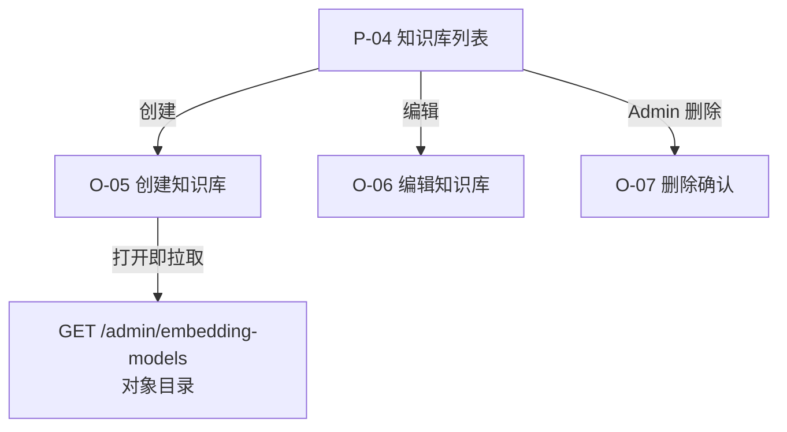

# 交互设计说明（IXD）：Web 管理端知识库模型目录对齐（V0.3）

**状态**：草案 v1  
**关联 PRD**：[`prd.md`](./prd.md)（V0.3）  
**前端词汇**：[`docs/frontend-admin/CONTEXT.md`](../../CONTEXT.md)  
**后端词汇**：[`docs/backend/context/knowledge/CONTEXT.md`](../../../backend/context/knowledge/CONTEXT.md)  
**后端契约**：[`docs/backend/api.md`](../../../backend/api.md)（§3）  
**上一版 IXD**：[`../V0.2/ixd.md`](../V0.2/ixd.md)  
**最后更新**：2026-08-12

---

## 1. 文档目的

在不改变 V0.2 页面框架（列表 + 模态）的前提下，完成 V0.3 前端交互对齐：消费后端配置驱动 EmbeddingModel 对象目录，并保证创建/编辑/列表闭环稳定。

---

## 2. 范围与原则

**范围内**

- 消费 `GET /admin/embedding-models` 对象数组（不再是 `string[]`）
- 创建模态模型下拉映射与提交参数对齐
- 列表“向量模型”列展示与创建结果一致
- 目录失败态、业务失败态、Staff 删除态回归

**范围外**

- Chat/LLM 相关 UI
- Provider 管理页
- 账号治理改造
- 后端 API 语义变更

**交互原则**

1. 创建请求不提交 `embeddingModel`，由后端按默认模型自动绑定。  
2. 列表“向量模型”继续展示 `embeddingModel`（id）。  
3. 前端不展示 `apiKey` 等敏感信息。  
4. Staff 删除交互延续 V0.2（不可提交删除）。  

---

## 3. 信息架构（V0.3 增量）

---

## 4. 屏态与行为

### 4.1 P-04 列表页（沿用 V0.2）

- 列保持：名称 / 命名空间 / 向量模型 / 描述 / 创建时间 / 操作
- “向量模型”列展示记录里的 `embeddingModel`（例如 `qwen3.7-text-embedding`）
- 不新增 provider 列、dimension 列

### 4.2 O-05 创建模态（V0.3 核心变化）

目录接口返回项结构：

- `id`
- `model`
- `dimension`
- `providerId`
- `priority`
- `isDefault`

展示规则：

- 创建弹窗不提供“向量模型选择”控件
- 可展示只读文案：`由后台默认模型决定`（或展示当前默认模型标签）

提交规则：

- 请求体不包含 `embeddingModel`

### 4.3 O-05b 目录失败

- 目录拉取失败时，创建流程不受影响（后端负责默认模型绑定）
- 可回退显示：`由后台默认模型决定`

### 4.4 O-06 编辑模态

- 行为不变：仅名称/描述可改
- 不展示可改模型控件

### 4.5 O-07 删除确认

- 行为不变：仅 Admin 可完成删除，Staff 不可提交删除

---

## 5. 关键状态机

### 5.1 创建弹窗状态

| 状态 | 触发 | UI 表现 | 可提交 |
| --- | --- | --- | --- |
| loadingCatalog | 打开 O-05 | 默认模型展示区加载中（可选） | 是 |
| catalogReady | 目录成功 | 展示默认模型标签（只读） | 是 |
| catalogFailed | 目录失败 | 展示“由后台默认模型决定” | 是 |

### 5.2 提交流程

1. 填写名称/命名空间/描述  
2. 前端校验通过  
3. `POST /admin/knowledge-bases`，body 不含 `embeddingModel`  
4. 成功 Toast + 列表刷新  
5. 失败展示后端 `message`  

---

## 6. 文案与显示约定（V0.3）

- 创建弹窗“向量模型”：只读提示，不可选择
- 列表“向量模型”列：显示 `embeddingModel`（id）
- 不显示：
  - `providerId`
  - `dimension`
  - `isDefault`
  - 任何 provider 密钥/连接信息

---

## 7. 验收追溯（对 PRD）

| PRD 验收 | IXD 对应 |
| --- | --- |
| AC-F301/302 | §4.2、§5.2 |
| AC-F303 | §4.1 |
| AC-F304 | §4.3、§5.1 |
| AC-F305 | §5.2 |
| AC-F306 | §4.5 |

---

## 8. 变更记录

| 日期 | 作者 | 变更说明 |
| ---- | ---- | -------- |
| 2026-08-12 | grilling 会话沉淀 | 首稿：管理端适配后端 V0.3 配置驱动目录对象契约 |

