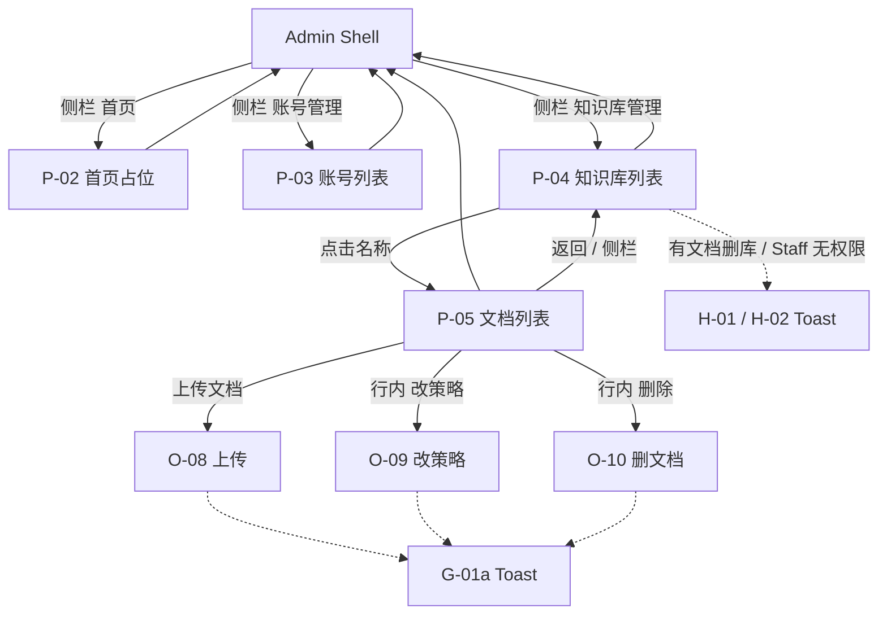

# 交互设计说明（IXD）：Web 管理端 Document 治理（V0.4）

**状态**：草案 v1  
**关联 PRD**：[`prd.md`](./prd.md)（V0.4）  
**领域词汇**：[`docs/frontend-admin/CONTEXT.md`](../../CONTEXT.md)  
**视觉真源**：[`ui.pen`](./ui.pen)（**不以线框替代**；布局、控件、文案以该稿帧为准）  
**上一版 IXD**：知识库容器见 [`../V0.2/ixd.md`](../V0.2/ixd.md)；模型目录差量见 [`../V0.3/ixd.md`](../V0.3/ixd.md)；壳层 / 账号见 [`../v0.1/ixd.md`](../v0.1/ixd.md)  
**最后更新**：2026-08-14

---

## 1. 文档目的

将 PRD V0.4 的 Document 治理（知识库列表增量 + 独立文档列表 + 上传 / 改策略 / 启用禁用 / 删文档）落实为可验收的交互规格：屏/态 ID、入口出口、手势结果、反馈与**已定稿文案**。帧命名与 Pencil 顶层帧一一对应，供实现对照；**本文不附 ASCII 线框**。

---

## 2. 范围与设计原则（交互层；不扩 PRD scope）

**范围内**

- 知识库列表：展示真实 `documentCount`；**点击名称**（名称前图标）进入文档列表；有文档时 Admin 删库 Toast 拦截（外观不灰显）
- 独立文档列表（非知识库详情页）：文件名模糊、分页；列与状态展示以 Pencil 为准
- 上传 Document（拖拽或点击；结构化策略表单 + UI 预填；提交中锁定；校验/业务失败在弹窗内顶部展示 `message`，对齐 O-05b）
- 改 ChunkStrategy（回填已存值；切种类整份替换字段；无 JSON 文本框）
- 行内 Enabled 开关（点即提交）
- 删除 Document 轻确认（Admin / Staff 均可，不灰显）
- 知识库不存在（`A002001`）错误态：不可当作空文档列表

**范围外**（与 PRD / CONTEXT 一致）

- 开始分块、解析、切片数、索引状态、Chunk 实体 UI
- 源文件预览 / 下载；URL 上传；多文件一次提交
- JSON 文本框编辑策略；同名覆盖
- 知识库详情页（上半改库、下半文档）
- 按 status / strategy / enabled 筛选文档
- 账号治理行为变更；后端 API / ObjectStorage 配置变更
- 视觉色值与组件实现细节（见 Pencil，不在本文复述）

**交互原则**

1. **视觉真源**：结构与文案以 `ui.pen` 对应帧为准；实现应对帧，不自行发明列或入口。
2. **壳层稳定**：受保护页共用 Admin Shell；侧栏三项与顶栏身份区沿用 V0.2；在文档列表时侧栏仍高亮「知识库管理」。
3. **写操作不另开路由**：上传 / 改策略 / 删文档均为文档列表页 Overlay；库级写操作仍在知识库列表 Overlay。
4. **权限差**：Staff 删**库**仍灰显 +「无权限」Toast；Staff 删**文档**与 Admin 相同，不灰显。有文档时 Admin 删库文案不得与 Staff 无权限写成同一句。
5. **反馈分层**：策略数字 / 上传业务失败用弹窗内顶部红条（同 O-05b）；成功用 Toast；开关失败可用 Toast。
6. **不写免责横幅**：界面不提示「本版本不切块 / 不可预览下载」。

---

## 3. 信息架构

**主导航（侧栏）**

| 项 | 目标 | 高亮 |
| -- | ---- | ---- |
| 首页 | P-02 | 在首页时 |
| 知识库管理 | P-04；进入 P-05 后仍高亮 | 在知识库列表、文档列表及本页模态时 |
| 账号管理 | P-03 | 在账号列表及账号模态时 |

**路由意图**（逻辑；path 实现前由工程选定）

| 屏 | 路由 |
| -- | ---- |
| 知识库列表 | 沿用 V0.2（如 `/knowledge-bases`）；需登录 |
| 文档列表 | `/knowledge-bases/{id}/documents`（或等价）；需登录 |
| 上传 / 改策略 / 删文档 | 无独立路由 |
| 知识库详情 | **不存在** |

---

## 4. 屏与态清单

与 Pencil 顶层帧名对齐。登录、账号 CRUD、改密、知识库创建/编辑等 V0.1–V0.3 行为见对应 IXD；本表列 **V0.4 增量与对读帧**。库级创建等既有 Overlay 帧仍在同一 `.pen` 中，行为不重复展开。

| ID | 前缀类型 | Pencil 帧名 | 挂载父级 | 入口 | 出口 |
| -- | -------- | ----------- | -------- | ---- | ---- |
| P-04 | Screen | — | Shell | 侧栏「知识库管理」 | 点名称 → P-05；库级 O-05/06/07 |
| H-01 | State | `P-04 / H-01 KnowledgeBase List Admin` | P-04 | Admin 有数据 | 点名称 → P-05；有文档删库 → Toast |
| H-02 | State | `P-04 / H-02 KnowledgeBase List Staff` | P-04 | Staff 有数据 | 点名称 → P-05；删库灰显 → 无权限 Toast |
| H-03 | State | `P-04 / H-03 KnowledgeBase List Empty` | P-04 | 无知识库 | 创建 → O-05（V0.2） |
| H-04 | State | `P-04 / H-04 KnowledgeBase List Filter Empty` | P-04 | Name 模糊无匹配 | 改关键词；创建仍可用 |
| O-07a | Overlay | `O-07a Delete Business Error` | P-04 | 删库确认后仍收到 `A002008` | 弹窗不关；记录仍在 |
| G-01 | Global | `G-01 Toast Success` | 知识库列表上方 | 库级成功反馈（沿用） | 自动消失 |
| P-05 | Screen | — | Shell | 自 P-04 点名称 | 返回 P-04；O-08/09/10 |
| V-01 | State | `P-05 / V-01 Document List` | P-05 | 库存在且有文档 | 上传 / 改策略 / 删除 / 开关 |
| V-02 | State | `P-05 / V-02 Document List Empty` | P-05 | 库存在且无文档 | 上传入口可用 → O-08 |
| V-03 | State | `P-05 / V-03 Document List Filter Empty` | P-05 | 文件名模糊无匹配 | 改关键词；上传仍可用 |
| V-04 | State | `P-05 / V-04 Document List KB Missing` | P-05 | 库 id 不存在（`A002001`） | 返回知识库列表；**非**空文档列表 |
| O-08 | Overlay | `O-08 Upload Document Modal` | P-05 | 页头「上传文档」 | 取消；成功 → G-01a |
| O-08a | Overlay | `O-08a Upload Structure Aware` | P-05 | 上传中切到结构分块 | 同 O-08 |
| O-08b | Overlay | `O-08b Upload Validation Error` | P-05 | 策略数字不合规提交 | 弹窗不关 |
| O-08c | Overlay | `O-08c Upload Submitting` | P-05 | 上传请求进行中 | 锁定；成功/失败后解锁 |
| O-08d | Overlay | `O-08d Upload Business Error` | P-05 | 业务失败（如 `A002015`） | 弹窗内顶部 `message`；可重试 |
| O-09 | Overlay | `O-09 Change Chunk Strategy` | P-05 | 行内「改策略」 | 取消；保存成功 → Toast |
| O-10 | Overlay | `O-10 Delete Document Confirm` | P-05 | 行内「删除」 | 取消；确认成功 → Toast |
| G-01a | Global | `G-01a Document List Toast Success` | 文档列表上方 | 上传 / 改策略 / 删文档 / 开关成功 | 自动消失 |

> 有文档时 Admin 删库 Toast 画在 `P-04 / H-01`（文案「库下仍有文档，不能删除」）；Staff 无权限 Toast 在 `P-04 / H-02`。文档列表成功 Toast 用 `G-01a`，与知识库列表 `G-01` 分底。

---

## 5. 逐屏 / 逐态规格

以下「结构」只描述 Pencil 已画出的区块与文案，不附线框。实现时打开对应帧。

### 5.1 P-04 / H-01 知识库列表 · Admin（V0.4 增量）

- **用户目标**：看见真实文档数；点名称进入文档治理；空库才可删库。
- **Pencil**：`P-04 / H-01 KnowledgeBase List Admin`
- **相对 V0.2 的差**
  - 表头含 **文档数**（示例见该帧）；**无**切片数 / 索引状态列
  - 名称前有 folder 图标；名称可点（主色），**无**行内「进入」按钮
  - 向量模型列：**两行**——主行模型 id + 副行提供商弱化（字号/色与「更新时间」列同构：13px / xs + `$fg-3`）；**不**再单行拼接 `provider / id`，**不**用 mono

  - 表头「更新时间」（非「创建时间」）：主行 `updatedAt` + 副行创建者 username（与文档列表 / 文件名双行同构）
  - 行操作仍为「编辑 / 删除」；`documentCount > 0` 时删除**外观不灰显**
  - 点有文档行的删除：**不打开** O-07；顶部 Toast「库下仍有文档，不能删除」
  - `documentCount = 0` 时删除仍 → O-07
- **手势**

| 手势 | 结果 |
| ---- | ---- |
| 点击名称 | → P-05（V-01 / V-02；库不存在则 V-04） |
| 有文档行删除 | Toast「库下仍有文档，不能删除」；不打开确认 |
| 空库行删除 | → O-07 |
| 编辑 / 创建 / 查询 | 同 V0.2 / V0.3 |

---

### 5.2 P-04 / H-02 知识库列表 · Staff（V0.4 增量）

- **Pencil**：`P-04 / H-02 KnowledgeBase List Staff`
- **与 H-01 的差**
  - 同样有文档数、点名称进入
  - 删除仍灰显可点；Toast「无权限删除知识库」（与「有文档」文案不同）
  - **不**因 `documentCount > 0` 改文案为「仍有文档」
- **手势**：点名称 → P-05；创建/编辑可用。

---

### 5.3 P-04 / H-03 · H-04 · O-07a（复用）

- **H-03 / H-04**：空列表 / 筛选无匹配结构见 V0.2 IXD；表头已含文档数（与 H-01 列一致）。
- **O-07a**：列表未刷新仍弹出删库确认并收到业务拒绝时，确认框内红条「知识库下仍有文档，不能删除」（`A002008` / 后端 `message`）。主路径有文档时 Admin **不应**先打开确认。

---

### 5.4 P-05 / V-01 文档列表 · 有数据

- **用户目标**：在某一知识库下查看与治理 Document。
- **Pencil**：`P-05 / V-01 Document List`
- **结构**
  - 侧栏：知识库管理高亮
  - 面包屑：`首页` › `知识库管理` › `{当前库 Name}`（示例「产品手册」）
  - 工具栏：文件名模糊（占位见该帧）+「查询」+ 主按钮「上传文档」
  - **无** status / enabled / strategy 筛选
  - 表头：文件名、状态、分块数、启用、更新时间、操作
  - 文件名列：图标 + 主行 OriginalFilename + 副行 `类型 · 大小`（如 `PDF · 1.2 MB`）
  - 更新时间列：主行 `updatedAt` + 副行创建者 username（与文件名双行同构；示例副行 `admin`）
  - 状态：色点 + 文字、**无底色**；本阶段运行时「待分块」；帧内可含预留态示例（分块中 / 分块成功 / 分块失败）
  - 分块数：未分块为「—」，不用 0
  - 启用：行内开关（示例含关闭行）
  - 行操作：「改策略」「删除」
  - 分页：默认 20 条/页（上限 100）
- **状态色（文案意图）**

| 后端（预留） | 界面文案 | 色意图 |
| ------------ | -------- | ------ |
| UPLOADED | 待分块 | 灰 `$fg-3` |
| CHUNKING | 分块中 | 蓝 `$primary` |
| CHUNKED | 分块成功 | 绿 `$success` |
| FAILED | 分块失败 | 红 `$danger` |

- **手势**

| 手势 | 结果 |
| ---- | ---- |
| 上传文档 | → O-08 |
| 查询 / 回车 | 按文件名模糊刷新 |
| 拨动启用开关 | 立即提交；无确认框；成功 Toast；失败 Toast `message`；行仍在列表 |
| 改策略 | → O-09（回填该行） |
| 删除 | → O-10 |
| 返回知识库列表 / 侧栏知识库管理 | → P-04 |
| 翻页 | 结果与分页一致 |

---

### 5.5 P-05 / V-02 文档列表 · 空

- **Pencil**：`P-05 / V-02 Document List Empty`
- **结构**：保留工具栏（含「上传文档」）与表头；无数据行；表头下空态「暂无文档」+ 可上传引导（文案以该帧为准）。
- **与 V-04 的差**：库存在，只是没有 Document；上传可用。
- **手势**：上传文档 → O-08。

---

### 5.6 P-05 / V-03 文档列表 · 筛选无匹配

- **Pencil**：`P-05 / V-03 Document List Filter Empty`
- **结构**：搜索框保留关键词（示例见该帧）；表头保留；空提示「暂无匹配的文档」（文案以该帧为准）；上传入口仍可用。
- **与 V-02 的差**：有查询条件但结果为空，不是库内零文档。

---

### 5.7 P-05 / V-04 知识库不存在（错误态）

- **用户目标**：知道目标库不可用，回到知识库列表；**不要**误当成空文档列表去上传。
- **Pencil**：`P-05 / V-04 Document List KB Missing`
- **结构**
  - 面包屑当前段：「知识库不存在」
  - **无**文档表头、**无**上传入口当作可用业务
  - 居中错误空态：标题「知识库不存在」；说明「该知识库不存在或已被删除…」；主按钮「返回知识库列表」（工具栏亦可有返回，以该帧为准）
- **与 H-03 / V-02 的差**：H-03 是知识库列表合法空；V-02 是某库合法空文档；V-04 是资源错误（`A002001`）。
- **手势**：返回知识库列表 → P-04。

---

### 5.8 O-08 上传文档（默认重叠分块）

- **用户目标**：选一份本地文件并提交分块策略（本版本不执行切块）。
- **Pencil**：`O-08 Upload Document Modal`（蒙层叠在文档列表上）
- **结构（定稿）**
  - 标题：上传文档
  - 本地文件投放区：空态文案「拖拽文件到此处，或点击选择」；类型提示「单文件 · txt / md / pdf / Office / 常见图片」（**不**写约 50MB / 服务端为准；**无**同名常驻说明）
  - 分块策略：下拉，默认「重叠分块」
  - 分块大小 `512`、重叠长度 `64`（字段旁**不**标注单位）
  - 操作：取消 / 上传
- **规则**
  - 单文件；拖拽或点击；已选后可拖拽替换或点击重选
  - 同名允许新增，不二次确认
  - 不等式：`chunkSize > 0` 且 `0 ≤ overlap < chunkSize`
- **手势**

| 手势 | 结果 |
| ---- | ---- |
| 上传成功 | 关弹窗；G-01a「上传成功」；列表新行；状态「待分块」；分块数「—」 |
| 取消 / 关闭 | 不提交 |
| 切到结构分块 | → O-08a 字段形态 |
| 数字不合规 | → O-08b |
| 提交中 | → O-08c |
| 业务失败 | → O-08d |

---

### 5.9 O-08a 上传 · 基于文档结构的分块

- **Pencil**：`O-08a Upload Structure Aware`
- **与 O-08 的差**：策略值为「基于文档结构的分块」；字段为最小 / 默认 / 最大 / 重叠，预填 `256` / `512` / `1024` / `32`；无 JSON 文本框。
- **不等式**：`min ≤ default ≤ max` 且三者 `> 0`；`0 ≤ overlap < minChunkSize`。

---

### 5.10 O-08b 上传 · 参数校验错误

- **Pencil**：`O-08b Upload Validation Error`
- **表现**：已选文件（投放区与 O-08 已选样式一致）；示例重叠长度与分块大小同为 `512`；**标题下、字段上**红条「重叠长度须小于分块大小」（同 O-05b）；弹窗不关闭；不发成功请求。
- **手势**：改正后重提；或取消。

---

### 5.11 O-08c 上传 · 提交中

- **Pencil**：`O-08c Upload Submitting`
- **表现**：投放区半透明 +「上传中，不可更换文件」；策略/参数弱化；取消弱化；主按钮 spinner +「上传中…」。
- **手势**：不可再次提交或更换文件；不要求百分比进度条。

---

### 5.12 O-08d 上传 · 业务失败

- **Pencil**：`O-08d Upload Business Error`
- **表现**：已选文件可替换；**标题下、字段上**红条展示后端 `message` 示例「对象存储不可用，请稍后重试。」（`A002015`，同 O-05b）；同类含空文件 / 类型不支持 / 超限（`A002010`–`A002012`）等，文案以后端为准；列表无新行；控件解锁可重试。

---

### 5.13 O-09 改策略

- **用户目标**：在 `UPLOADED` 时纠正种类或参数。
- **Pencil**：`O-09 Change Chunk Strategy`
- **结构**
  - 标题：改策略
  - 文件：只读（示例 `handbook.pdf`）
  - 分块策略 + 数字字段：**回填已存值**（帧示例重叠分块 `400` / `80`，**不是**上传预填 512/64）
  - 切种类时字段整份替换为目标种类预填（与上传切种类相同）
  - 操作：取消 / 保存
  - **无** JSON 文本框
- **手势**

| 手势 | 结果 |
| ---- | ---- |
| 保存成功 | 关弹窗；Toast；`updatedAt` 刷新；列表顺序反映更新 |
| 校验/业务失败 | 弹窗内错误；不关 |
| 取消 | 不提交 |

---

### 5.14 O-10 删除文档轻确认

- **Pencil**：`O-10 Delete Document Confirm`
- **文案（定稿）**
  - 标题：删除文档
  - 副标题：此操作不可恢复
  - 确认：确定删除该文档？
  - 文件名引用（示例 `handbook.pdf`）
  - 操作：取消 / 确认删除（危险色）
- **不写**：对象存储、不可下载等实现细节。
- **手势**

| 手势 | 结果 |
| ---- | ---- |
| 确认删除且成功 | 关弹窗；Toast；该行消失；知识库文档数 -1 |
| 取消 | 关闭，记录不变 |
| Staff / Admin | 均可提交；删除入口不灰显 |

---

### 5.15 G-01a 文档列表成功 Toast

- **Pencil**：`G-01a Document List Toast Success`
- **表现**：叠在文档列表上方；示例「上传成功」。同类成功文案可为「保存成功」「删除成功」等短提示（实现可复用同一组件，文案按动作切换）。
- **出现时机**：上传 / 改策略 / 删文档 / 开关成功后；关闭相关弹窗并刷新列表。

---

## 6. 全局交互规则

1. 未登录或 `A000001` → 清会话 → 登录页（V0.1）。
2. 文档列表不提供库的 Name / 描述 / 删库入口。
3. Enabled 与 DocumentStatus 解耦；禁用文档仍列出并计入 `documentCount`。
4. 改策略仅当状态允许时（本阶段均为 `UPLOADED`）；离开 `UPLOADED` 后的冻结以后续版本为准，本 IXD 不扩入口。
5. 上传与改策略禁止 JSON 文本框；单位不在字段旁展示。
6. 有文档时 Admin 删库：Toast 拦截优先于打开确认；O-07a 仅覆盖「仍打开确认却被后端拒绝」的兜底。

---

## 7. 文案与反馈汇总

| 场景 | 形态 | 文案 / 来源 |
| ---- | ---- | ----------- |
| 有文档删库（Admin） | Toast | 库下仍有文档，不能删除 |
| 无权限删库（Staff） | Toast | 无权限删除知识库 |
| 删库业务拒绝（兜底） | 弹窗红条 | 知识库下仍有文档，不能删除（或后端 `message`） |
| 上传 / 改策略 / 删文档 / 开关成功 | Toast | 如「上传成功」等 |
| 策略数字不合规 | 弹窗内顶部红条 | 如「重叠长度须小于分块大小」 |
| 上传业务失败 | 弹窗内顶部红条 | 后端 `message`（如对象存储不可用） |
| 知识库不存在 | 页内错误空态 | 知识库不存在 + 返回列表 |
| 空文档列表 | 页内空态 | 暂无文档（见 V-02） |
| 筛选无文档 | 页内空态 | 暂无匹配的文档（见 V-03） |
| 删文档确认 | 轻确认 | 确定删除该文档？ |

---

## 8. 无障碍与平台差异

- 桌面 Web 管理端；点击与键盘：查询框支持回车查询（与知识库列表一致）。
- 投放区须同时支持拖拽与点击选择，避免仅拖拽可达。
- 开关与危险删除按钮需有可见标签（「启用」「确认删除」），不只依赖颜色。
- 本阶段不单独验收读屏脚本；实现时控件保有可访问名称即可。

---

## 9. PRD 验收追溯

| AC ID | IXD 位置（章节 / ID） |
| ----- | --------------------- |
| AC-F401 | §5.1 / §5.4；H-01→P-05 |
| AC-F402 | §5.1 H-01 文档数列 |
| AC-F403 | §5.4 返回 / 侧栏 |
| AC-F404 | §5.1 有文档删库 Toast |
| AC-F405 | §5.2 Staff 删库 |
| AC-F406 | §5.1 空库 → O-07（V0.2） |
| AC-F407 | §5.8 O-08；§5.15 G-01a |
| AC-F408 | §5.8 同名无二次确认、无常驻说明 |
| AC-F409 | §5.9 O-08a |
| AC-F410 | §5.10 O-08b |
| AC-F411 | §5.12 O-08d（类型/空/超限） |
| AC-F412 | §5.12 O-08d（存储） |
| AC-F413 | §5.11 O-08c |
| AC-F414 | §5.4 V-01 |
| AC-F415 | §5.4 / §5.6 筛选分页 |
| AC-F416 | §5.5 V-02 |
| AC-F417 | §5.7 V-04 |
| AC-F418 | §5.13 O-09 |
| AC-F419 | §5.13 回填非上传预填 |
| AC-F420 / AC-F421 | §5.4 启用开关 |
| AC-F422 / AC-F423 | §5.14 O-10 |
| AC-F424 | §6 未登录 |

---

## 10. Out of Scope

与 PRD §1 范围外及 CONTEXT Out-of-scope 一致，IXD **不出现**对应入口或屏，包括但不限于：开始分块、预览/下载、URL 多文件上传、JSON 策略编辑器、知识库详情页、按启用/状态筛选、账号启用停用 UI。

---

## 11. 变更记录

| 日期 | 说明 |
| ---- | ---- |
| 2026-08-14 | 初稿：对齐 V0.4 PRD 与 `ui.pen` 已画帧；无 ASCII 线框 |
