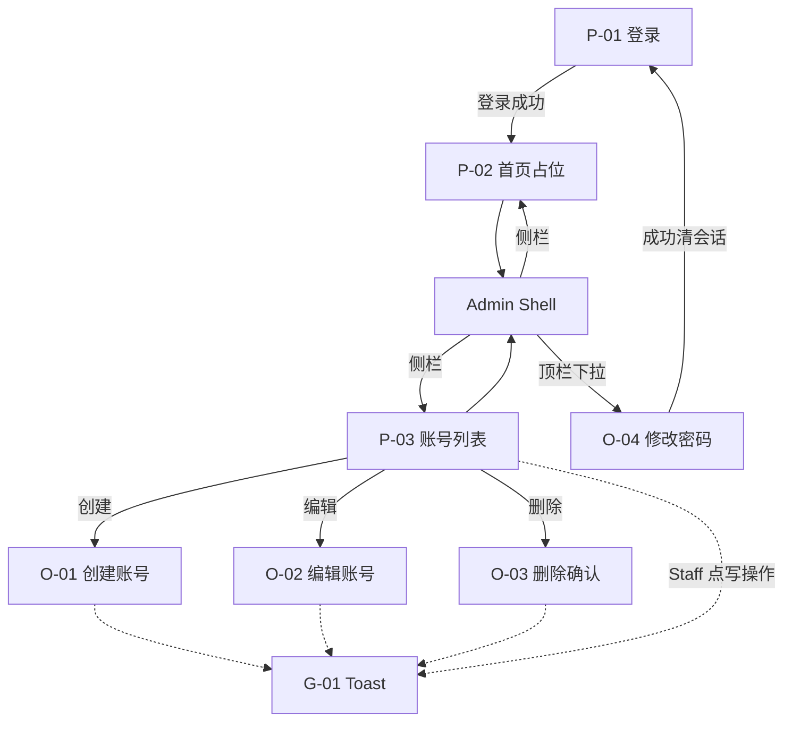

# 交互设计说明（IXD）：Web 管理端登录与账号管理

**状态**：草案 v1  
**关联 PRD**：[`prd.md`](./prd.md)（V0.1）  
**领域词汇**：[`docs/frontend-admin/CONTEXT.md`](../../CONTEXT.md)  
**视觉参考**：[`ui/登录账号管理.pen`](./ui/登录账号管理.pen)  
**最后更新**：2026-08-07

---

## 1. 文档目的

将 PRD V0.1 的登录、管理壳层、首页占位与账号治理行为，落实为可验收的交互规格：屏/态 ID、入口出口、手势结果、反馈与文案意图，并与 Pencil 帧命名对齐，供实现与后续 ui-plan / 换皮使用。

---

## 2. 范围与设计原则（交互层；不扩 PRD scope）

**范围内**

- 登录（含记住用户名）、登出、会话恢复与过期跳转
- 管理壳层：侧栏「首页 / 账号管理」；顶栏身份下拉（修改密码、登出）；面包屑
- 首页占位
- 账号列表：分页、username 模糊、role 筛选；行展示头像缩写 + 用户名等
- 创建账号、编辑账号（改角色 + 可选重置密码）、删除确认、修改自己的密码（均为模态）
- Staff 写操作入口灰显但可点，点击后 Toast 提示无权限
- 字段校验、业务错误与 Toast 反馈

**范围外**（与 PRD / CONTEXT 一致）

- 启用/停用、自定义角色、验证码、失败锁定
- 昵称/头像上传/邮箱、审计日志页
- 强制首次登录改密、EndUser / RAG 业务页
- 视觉色值与组件库实现细节（见 Pencil / 后续 ui-plan）

**交互原则**

1. **壳层稳定**：受保护页共用 Admin Shell；侧栏两项、顶栏身份区位置固定。
2. **写操作不另开路由**：创建 / 编辑 / 删除 / 改己密均为当前页 Overlay。
3. **权限表现一致**：Staff 与 Admin 列表布局一致；无权限入口灰显但仍可点击，用 Toast 说明（见 §6，相对 PRD「禁用 + tooltip」的设计确认）。
4. **危险操作二次确认**：删除必须确认弹窗；重置他人密码须二次输入确认。
5. **反馈分层**：字段内联 → 弹窗内业务错误 → Toast 成功/无权限/网络异常。

---

## 3. 信息架构



**主导航（侧栏）**

| 项 | 目标 |
| -- | ---- |
| 首页 | P-02 |
| 账号管理 | P-03 |

**顶栏身份下拉**

| 项 | 目标 |
| -- | ---- |
| 修改密码 | O-04 |
| 登出 | 清会话 → P-01 |

---

## 4. 屏与态清单

| ID | 前缀类型 | 名称 | 挂载父级 | 入口 | 出口 |
| -- | -------- | ---- | -------- | ---- | ---- |
| DS-00 | Design system | 设计系统（色板/组件） | — | 设计稿参考 | — |
| P-01 | Screen | 登录 | — | 匿名访问；会话失效；登出；改己密成功 | 成功 → P-02；已登录访问 → 重定向 P-02 |
| H-01 | State | 登录默认 | P-01 | 进入登录 | 提交 / 勾选记住用户名 |
| H-02 | State | 登录错误 | P-01 | 凭证错误等 | 修正后重试 |
| P-02 | Screen | 首页占位 | Shell | 登录成功默认；侧栏首页 | 侧栏 → P-03；顶栏 → O-04 / 登出 |
| P-03 | Screen | 账号列表 | Shell | 侧栏账号管理 | O-01 / O-02 / O-03；筛选分页 |
| H-01 | State | 账号列表·Admin | P-03 | Admin 进入列表 | 写操作可用 |
| H-02 | State | 账号列表·Staff | P-03 | Staff 进入列表 | 写操作灰显可点 → G-01 |
| O-01 | Overlay | 创建账号 | P-03 | 页头「创建账号」 | 取消/关闭；成功 Toast + 刷新列表 |
| O-02 | Overlay | 编辑账号 | P-03 | 行内「编辑」 | 取消/关闭；成功 Toast + 刷新 |
| O-03 | Overlay | 删除确认 | P-03 | 行内「删除」 | 取消；确认后 Toast + 刷新 |
| O-04 | Overlay | 修改密码（己） | Shell | 顶栏下拉「修改密码」 | 取消；成功 → 清会话 → P-01 |
| G-01 | Global | Toast | 任意壳内页 | 成功 / 无权限 / 网络等 | 自动消失 |

> 备注：Pencil 帧名示例 `P-03 / H-01 Account List Admin`、`O-02 Edit Account Modal` 与上表 ID 对应。

---

## 5. 逐屏 / 逐态规格

### 5.1 P-01 / H-01 登录默认

- **用户目标**：用用户名密码进入管理端；可选记住用户名。
- **线框（ASCII）**

```
┌─────────────────────────────────────┐
│           （全屏氛围背景）            │
│     ┌─────────────────────────┐     │
│     │  Hello-AgentR / 品牌     │     │
│     │  用户名 [____________]   │     │
│     │  密码   [____________]   │     │
│     │           □ 记住用户名   │     │
│     │        [    登录    ]    │     │
│     └─────────────────────────┘     │
└─────────────────────────────────────┘
```

- **状态表**

| 态 | 表现 |
| -- | ---- |
| 默认 | 空表单；若曾勾选记住用户名则预填 username，密码为空 |
| 提交中 | 主按钮 loading，防重复提交 |
| 校验失败 | 字段内联错误（规则见 §6） |

- **手势与结果**

| 手势 | 结果 |
| ---- | ---- |
| 提交正确凭证 | 写入 token；进入 P-02；顶栏显示 username + 角色 |
| 切换「记住用户名」 | 仅影响 username 本地缓存策略，不存密码 |
| 已登录访问本页 | 不停留，重定向 P-02 |

- **文案（意图）**

| Key | 中文 |
| --- | ---- |
| login.title | 登录相关标题（与视觉稿一致） |
| login.username | 用户名 |
| login.password | 密码 |
| login.remember | 记住用户名 |
| login.submit | 登录 |

---

### 5.2 P-01 / H-02 登录错误

- **用户目标**：理解失败原因并重试。
- **状态**：页内错误条展示后端文案（如「用户名或密码错误」）；不进入壳层；密码可清空或保留由实现定，**不**因失败而写入 token。
- **手势**：修改后再次提交 → 回 H-01 成功路径或仍 H-02。

---

### 5.3 P-02 首页占位

- **用户目标**：登录后有稳定落地页，后续业务可挂载。
- **线框**

```
┌────────┬──────────────────────────────┐
│ Brand  │ 面包屑: 首页    [身份▾]       │
│ 首页●  │──────────────────────────────│
│ 账号管理│                               │
│        │      首页占位说明文案          │
│        │   （无业务卡片/统计要求）       │
└────────┴──────────────────────────────┘
```

- **状态表**：仅默认占位；本阶段无加载业务数据要求。
- **手势**

| 手势 | 结果 |
| ---- | ---- |
| 点侧栏「账号管理」 | → P-03 |
| 点身份芯片 | 展开下拉：修改密码 / 登出 |
| 登出 | 清 token → P-01（记住用户名则预填） |

---

### 5.4 P-03 账号列表（共用壳）

- **用户目标**：分页筛选查看 AdminUser；Admin 可治理，Staff 只读写入口体验见 H-02。
- **线框**

```
┌────────┬──────────────────────────────────────────┐
│ Brand  │ 首页 › 账号管理              [身份▾]      │
│ 首页   │──────────────────────────────────────────│
│ 账号●  │ [用户名搜索] [角色▾全部] [查询] [创建账号] │
│        │──────────────────────────────────────────│
│        │ ID  用户名(头像+名)  角色  创建时间  操作 │
│        │ …   alice             运营   …   编辑 删除│
│        │ 共 N 条 · 每页 20          ‹ 1 ›         │
└────────┴──────────────────────────────────────────┘
```

- **列表字段（UI）**：ID、用户名（圆形字头像 + 名）、角色、创建时间、操作。  
  > 相对 PRD「展示 bootstrap」：视觉稿不展示 Bootstrap 列；保护逻辑仍按后端（如 Bootstrap 目标删除禁用）。
- **默认排序**：创建时间倒序；默认 pageSize=20。
- **筛选**：username 模糊；role 精确（全部 / 管理员 / 运营人员）；点「查询」或等价触发刷新。
- **操作列**：编辑、删除（带 icon）；文案不用「重置密码 / 改角色」分列入口。

#### H-01 Admin

| 控件 | 行为 |
| ---- | ---- |
| 创建账号 | 打开 O-01 |
| 编辑 | 打开 O-02（目标行） |
| 删除 | 打开 O-03；对 Bootstrap / 当前自己等保护目标：**入口禁用**并有简短原因（布局占位保留） |
| 筛选/分页/改己密/登出 | 可用 |

#### H-02 Staff

| 控件 | 行为 |
| ---- | ---- |
| 创建 / 编辑 / 删除 | **灰显外观，仍可点击** → G-01「无权限执行此操作」；不打开可提交表单 |
| 筛选/分页/改己密/登出 | 可用 |
| 布局 | 与 H-01 控件占位一致 |

---

### 5.5 O-01 创建账号

- **用户目标**：Admin 开通带角色的新账号。
- **线框**

```
        ┌─────────────────────────┐
        │ 创建账号              ✕ │
        │  用户名  [____________]  │
        │  密码    [____________]  │
        │  角色    [运营人员 ▾]   │
        │           [取消] [创建] │
        └─────────────────────────┘
```

- **状态表**

| 态 | 表现 |
| -- | ---- |
| 默认 | 空表单；角色默认「运营人员」（或实现选定默认，须为 ADMIN/STAFF 之一） |
| 字段校验失败 | 内联错误 |
| 业务失败 | 弹窗内 `message`（如用户名重复） |
| 成功 | 关弹窗；G-01 成功；列表刷新可见新账号 |

- **手势**：取消/蒙层/✕ → 关闭不提交；创建 → 校验通过后请求。

- **文案意图**

| Key | 中文 |
| --- | ---- |
| create.title | 创建账号 |
| create.username.ph | 4–32 位字母、数字或下划线 |
| create.password.ph | 8–64 位，须含字母与数字 |
| create.role | 角色（管理员 / 运营人员） |
| create.submit | 创建 |
| create.cancel | 取消 |

---

### 5.6 O-02 编辑账号

- **用户目标**：Admin 变更角色；可选重置该账号密码（需二次确认）。
- **说明**：合并 PRD 原「重置他人密码」「变更角色」为单一「编辑」入口（与视觉稿一致）。
- **线框**

```
        ┌─────────────────────────────┐
        │  编辑账号                  ✕ │
        │  用户名  [alice]（只读）      │
        │  提示：用户名创建后不可修改    │
        │  角色    [运营人员 ▾]        │
        │  ─────────                   │
        │  新密码（可选）[__________]  │
        │  确认新密码   [__________]  │
        │              [取消] [保存]   │
        └─────────────────────────────┘
```

- **状态 / 规则**

| 项 | 规则 |
| -- | ---- |
| 用户名 | 只读展示 |
| 角色 | 可改为管理员 / 运营人员 |
| 新密码 | 留空 = 不重置；填写则须符合密码规则，且与「确认新密码」一致 |
| 确认新密码 | 仅当填写了新密码时必填且一致；新密码为空时确认框应为空或忽略 |
| 保护规则失败 | 弹窗内展示后端文案（如末 Admin）；数据不变 |
| 成功 | 关弹窗；Toast；列表刷新 |

---

### 5.7 O-03 删除确认

- **用户目标**：确认删除目标账号，避免误触。
- **线框**

```
        ┌─────────────────────────────┐
        │ ⚠ 删除账号                   │
        │   此操作不可恢复              │
        │  ┌─────────────────────────┐ │
        │  │ 确定删除账号「alice」吗？ │ │
        │  │ 将执行删除，账号及其关联  │ │
        │  │ 登录态会立即失效，且无法  │ │
        │  │ 恢复。                   │ │
        │  └─────────────────────────┘ │
        │         [取消] [确认删除]    │
        └─────────────────────────────┘
```

- **手势**：取消/关闭 → 不删；确认删除 → 成功则 Toast + 列表去掉该行；失败则弹窗内错误。
- **文案**：不使用「物理删除」字样；强调不可恢复与登录态失效即可。

---

### 5.8 O-04 修改密码（自己）

- **用户目标**：轮换本人密码；成功后重新登录。
- **线框**

```
        ┌─────────────────────────────┐
        │ 修改密码                    ✕ │
        │ 成功后需重新登录              │
        │ 当前密码   [______________]  │
        │ 新密码     [______________]  │
        │ 确认新密码 [______________]  │
        │         [取消] [确认修改]    │
        └─────────────────────────────┘
```

- **手势与结果**

| 手势 | 结果 |
| ---- | ---- |
| 确认修改且成功 | 提示需重新登录；清本地会话；→ P-01；旧 token 不可用；若记住用户名则预填 |
| 旧密码错误 / 新密码不合规 / 两次不一致 | 弹窗内错误；保持登录 |
| 取消 | 关闭，会话不变 |

---

### 5.9 G-01 Toast

| 场景 | 文案意图 |
| ---- | -------- |
| 创建/编辑/删除成功 | 短成功提示（如「创建成功」） |
| Staff 点击灰显写操作 | 「无权限执行此操作」 |
| 网络 / 未知 5xx | 错误 Toast |
| 出现位置 | 壳层内容区顶部居中或约定角；自动消失 |

---

## 6. 全局交互规则

### 6.1 会话

- Token 仅 localStorage；启动调用 `me`；失败或业务未登录码（如 `A000001`）→ 清会话 → P-01。
- 不缓存密码；记住用户名仅缓存 username。

### 6.2 能力矩阵（UI）

| 动作 | Admin | Staff |
| ---- | ----- | ----- |
| 登录 / 登出 / 改己密 / 列表筛选分页 | 能 | 能 |
| 创建 / 编辑（含改角色、重置他人密码）/ 删除 | 能（受保护规则） | 入口灰显可点 → Toast 无权限，不提交 |

### 6.3 输入边界（与后端对齐）

- **用户名**：4–32；`[a-zA-Z0-9_]`；创建后不可改。
- **密码**：8–64；须含字母与数字；响应永不展示。
- **角色**：`ADMIN` / `STAFF`；展示「管理员」「运营人员」。

### 6.4 反馈分层

1. 字段校验 → 内联  
2. 登录失败 → 页内错误条  
3. 弹窗业务失败 → 弹窗内 `message`  
4. 成功写操作 / Staff 无权限 / 网络异常 → Toast  

### 6.5 壳层导航

- 面包屑：首页为 `首页`；账号列表为 `首页 › 账号管理`（末级为当前页强调）。
- 身份区为下拉触发器（非顶栏并列「修改密码」「登出」按钮）。

---

## 7. 文案与反馈汇总

| 场景 | 推荐文案 |
| ---- | -------- |
| Staff 无权限 | 无权限执行此操作 |
| 删除副标题 | 此操作不可恢复 |
| 删除正文 | 确定删除账号「{username}」吗？将执行删除，账号及其关联登录态会立即失效，且无法恢复。 |
| 编辑用户名提示 | 用户名创建后不可修改 |
| 重置密码可选 | 留空则不修改密码 |
| 确认新密码 | 若填写新密码，请再次输入确认 |
| 改己密提示 | 成功后需重新登录 |
| 角色选项 | 管理员 / 运营人员 |

---

## 8. 无障碍与平台差异

- 本阶段不设 WCAG 硬指标。
- 灰显可点控件须可通过点击得到明确反馈（Toast），避免「看起来不能点且无任何响应」。
- 平台：桌面浏览器优先；不承诺移动端管理体验。

---

## 9. PRD 验收追溯

| AC ID | IXD 位置（章节 / ID） |
| ----- | --------------------- |
| AC-F001 | §5.1 P-01 → P-02 |
| AC-F002 | §5.2 P-01 / H-02 |
| AC-F003 / AC-F004 | §5.1 记住用户名 |
| AC-F005 / AC-F006 / AC-F007 | §6.1 会话 |
| AC-F008 | §5.1 已登录访问登录页 |
| AC-F009 | §5.3 / §5.4 侧栏与登出 |
| AC-F010 | §5.3 P-02 |
| AC-F011 / AC-F012 | §5.4 P-03 列表与筛选 |
| AC-F013 / AC-F015 | §5.5 O-01 |
| AC-F014 / AC-F019 / AC-F022 | §5.4 H-02（灰显可点 + Toast；布局一致） |
| AC-F016 / AC-F017 / AC-F018 | §5.6 O-02、§5.7 O-03 |
| AC-F020 / AC-F021 | §5.8 O-04 |
| REQ-F013 | §6.4、§5.9 G-01 |

**与 PRD 的已确认差异（设计稿）**

| 项 | PRD/CONTEXT 原文倾向 | 本 IXD / Pencil |
| -- | -------------------- | --------------- |
| Staff 无权限 | 禁用 + tooltip | 灰显可点 + Toast |
| 重置密码 / 改角色 | 独立模态 | 合并为 O-02 编辑账号 |
| 列表 Bootstrap 列 | 需求表含展示 | UI 不展示该列 |
| 删除文案「物理删除」 | CONTEXT 曾用 | 改为「将执行删除…」 |

---

## 10. Out of Scope

- 启用/停用、自定义角色、验证码、失败锁定 UI  
- 昵称/头像上传/邮箱、审计日志  
- 强制首次登录改密  
- EndUser、RAG 业务页  
- 视觉定稿实现细则（色值/组件代码）  

---

## 11. 变更记录

| 日期 | 作者 | 变更说明 |
| ---- | ---- | -------- |
| 2026-08-07 | IXD v1 | 首稿：对齐 PRD V0.1 与 Pencil《登录账号管理》定稿交互（含编辑合并、Staff Toast、删除文案、重置二次确认） |
