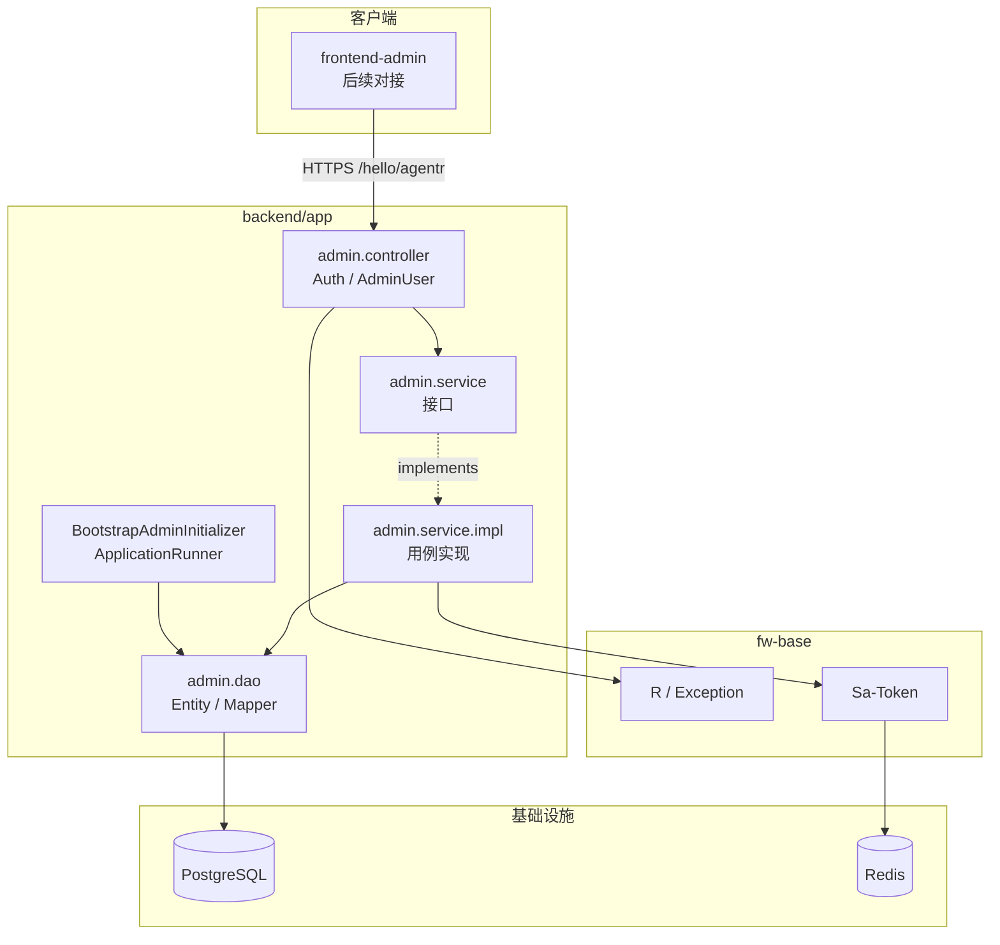

## Context

- **来源**：PRD `docs/backend/版本迭代/V0.1/prd.md`；词汇表 `docs/backend/CONTEXT.md`；ADR-0001
- **现状**：`backend` 已具备 `fw-base`（`R<T>`、异常、MyBatis-Plus、Snowflake、Sa-Token/Redis），`app` 尚无 AdminUser 业务模块
- **约束**：Java 21 / Spring Boot 3；上下文路径以 `application.yaml` 为准（当前 `server.servlet.context-path: /hello/agentr`）；管理端与 EndUser 身份隔离
- **消费方**：后续 `frontend-admin`；本变更只交付后端 API

## Goals / Non-Goals

**Goals:**

- 落地 AdminUser 持久化、Bootstrap 初始化、管理端认证会话、账号治理 API 与角色鉴权
- API 行为可测，对齐 PRD 验收标准（AC-001～AC-026）

**Non-Goals:**

- 前端实现、EndUser 身份、启用/停用、自定义权限码、验证码/锁定、审计日志 API、强制首登改密

## 组件层级

## Decisions

### D1. 模块落点

- **选择**：`com.xgc.agent.rag.admin`（controller / service / dao / dto）
- **备选**：放在 `fw-base` → 拒绝（业务域不属于跨业务基建）

### D2. 登录态类型

- **选择**：Sa-Token `StpUtil` 使用独立 loginType，例如 `admin`，loginId 为 AdminUser 雪花 ID；登录成功后 session/扩展信息写入 role、username、bootstrap
- **备选**：与未来 EndUser 共用默认 loginType → 拒绝（违背身份隔离）

### D3. 密码哈希

- **选择**：BCrypt（Spring Security Crypto 或等价），不存明文
- **备选**：MD5/SHA 无盐 → 拒绝

### D4. 表结构（逻辑）

表名建议：`t_admin_user`

| 字段 | 说明 |
| --- | --- |
| id | Snowflake |
| username | 唯一，4–32，`[a-zA-Z0-9_]` |
| password_hash | BCrypt |
| role | `ADMIN` / `STAFF` |
| bootstrap | boolean，默认 false |
| create_time / update_time | 审计字段 |
| deleted | 若框架默认逻辑删除开启：本变更**物理删除**须走真删或绕过逻辑删，与 PRD「物理删」一致 |

### D5. pageSize 超上限

- **选择**：`pageSize > 100` **拒绝**（客户端参数错误），不截断
- **备选**：截断为 100 → 不采用（行为隐式）

### D6. 角色鉴权

- **选择**：Service 内基于当前登录 role 校验能力矩阵；Admin 专属写操作在入口显式拒绝 Staff
- **备选**：Sa-Token 权限码体系 → V0.1 不做自定义权限码，仅两角色

### D7. Bootstrap 初始化

- **选择**：`ApplicationRunner`（失败则阻止就绪）：无 `bootstrap=true` 则插入；已存在则跳过；`admin` 被非 bootstrap 占用则抛错终止启动

## API 端点规范

基础前缀：`{context-path}` = `/hello/agentr`（若配置变更，前缀随之变更）。  
统一响应：`R<T>`（`code="0"` 成功）。  
鉴权：除登录外，请求头 `Authorization: <token>`。

| 方法 | 路径 | 鉴权 | 说明 |
| --- | --- | --- | --- |
| POST | `/admin/auth/login` | 匿名 | body: `{ username, password }` → data: `{ token, ...可选资料 }` |
| POST | `/admin/auth/logout` | 已登录 | 作废当前 token |
| GET | `/admin/auth/me` | 已登录 | 当前 AdminUser 资料（无密码） |
| PUT | `/admin/auth/password` | 已登录 | body: `{ oldPassword, newPassword }`；成功后踢掉该账号全部 token |
| GET | `/admin/users` | Admin/Staff | query: `page`, `pageSize`(默认20,≤100), `username?`, `role?` |
| POST | `/admin/users` | Admin | body: `{ username, password, role }` |
| PUT | `/admin/users/{id}/password` | Admin | body: `{ newPassword }`；含 Bootstrap；踢全部 token |
| PUT | `/admin/users/{id}/role` | Admin | body: `{ role }`；末 Admin 保护 |
| DELETE | `/admin/users/{id}` | Admin | 物理删除；保护规则；踢全部 token |

**错误语义（产品层）**：

- 登录失败：统一「用户名或密码错误」
- 未登录 / 无权限 / 校验失败 / 保护规则：客户端错误（走既有 `ClientException` + 错误码扩展）
- Bootstrap 冲突：启动失败（非 HTTP）

## Risks / Trade-offs

- [初始密码明文出现在文档/仓库] → 部署文档强调立即改密；后续可加强制首登改密（本变更不做）
- [逻辑删除与物理删冲突] → 实现时明确真删路径并加测试
- [工程文档曾写 `/api/agentr` 与配置不一致] → API 以运行配置为准，必要时另开文档修正任务
- [Staff 可见全量列表] → 产品已接受；无字段级脱敏需求（本无敏感字段除哈希，且哈希不返回）

## Migration Plan

1. **选定方案**：不使用 Flyway/Liquibase；DDL 以手工 SQL 维护于 `app/src/main/resources/db/t_admin_user.sql`，部署前在目标库执行
2. 启动应用 → 自动 Bootstrap（业务初始化，非 DDL）
3. 用 `admin` / `admin@123456` 验收登录与治理闭环
4. **回滚**：按 proposal 回滚方案；默认保留表数据

## Phase 1 结论（探查与依赖）

### 复用清单（禁止重复造轮子）

| 能力 | 复用点 |
| --- | --- |
| 统一响应 | `com.xgc.agent.framework.base.result.R` |
| 错误码 / 异常 | `BaseErrorCode`、`ClientException` / `ServerException`；可复用已有用户名/密码相关码（如 `USER_NAME_*`、`PASSWORD_*`），不足再扩展 |
| 全局异常 | `GlobalExceptionHandler`（已映射 Sa-Token 未登录 / 无角色） |
| MyBatis-Plus | `MyBatisPlusConfig` 分页、`MyBatisPlusMetaObjectHandler` 审计字段填充 |
| 分布式 ID | Snowflake + `IdType.ASSIGN_ID` |
| Sa-Token | `fw-base` 已引入 starter + redis-template；`application.yaml` 已配 `Authorization`；**尚无** `StpUtil` / loginType 业务代码，本变更新增 |
| 包扫描 | `HelloAgentApplication`：`scanBasePackages = "com.xgc.agent"`，可覆盖 `com.xgc.agent.rag.admin` |

### 其他探查结论

- **无** AdminUser / 登录业务代码；从零建 `com.xgc.agent.rag.admin`
- 实体惯例含 `@TableLogic deleted` + MetaObjectHandler 填 `deleted=0`；本变更物理删除须绕过逻辑删（实体可不加 `@TableLogic`，并用 `deleteById` 真删）
- **密码哈希**：classpath 原无 `spring-security-crypto`；已在 `app/pom.xml` 增加该依赖（不对齐 Hutool，遵循 design D3）
- 启动类实际名为 `HelloAgentApplication`（文档中的 `HelloAgentRApplication` 已过时）

## Open Questions

- ~~项目是否已有统一 DB migration 工具？~~ → **无**；**不引入 Flyway**，DDL 手工执行 `resources/db/t_admin_user.sql`
- 强制首登改密：PRD 开放问题，本设计明确 **不做**
