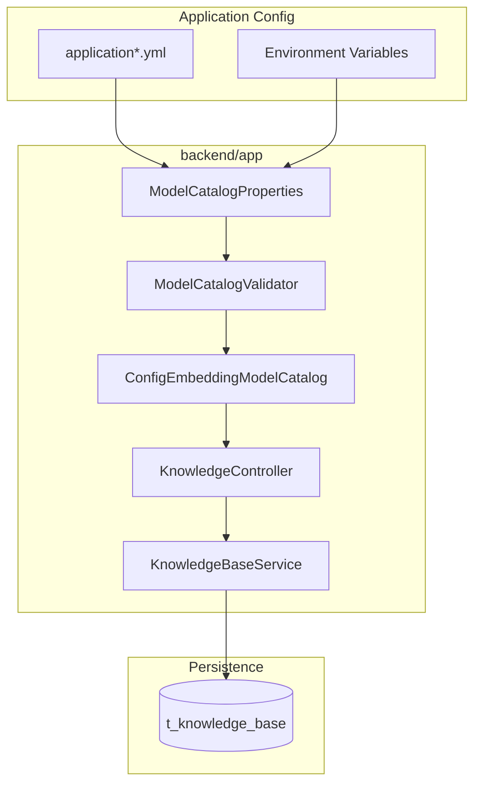

## Context

- **来源**：`docs/backend/版本迭代/V0.3/prd.md`、`docs/backend/context/knowledge/CONTEXT.md`
- **现状**：V0.2 `GET /admin/embedding-models` 返回模拟字符串列表，创建 KnowledgeBase 仅做字符串成员校验
- **目标**：将目录升级为配置驱动对象目录，并在启动期收敛配置风险

## Goals / Non-Goals

**Goals:**

- 支持 YAML 配置多 provider 与多 embedding model（仅 Embedding）
- 目录 API 返回对象结构并提供稳定排序
- 启动校验覆盖关键一致性规则，运行期不再兜底猜测
- 保持 KnowledgeBase 绑定字段不变（仍是 `embeddingModel=id`）

**Non-Goals:**

- Chat/LLM 配置与 API
- Provider/Model 管理 API
- 上游模型连通性探测或真实请求
- 前端管理端改造

## 组件层级图

## Decisions

### D1. Provider 配置结构

- **选择**：`modelProviders` 用 map，key 即 providerId，且 key 仅允许 `alibailian`、`siliconflow`
- **原因**：去重简单，引用关系直观；符合已确认 K1（每厂商最多一条）
- **备选拒绝**：list + type 字段（重复表达且与已确认 K1 冲突）

### D2. Model 配置结构

- **选择**：`embeddingModels` 为 list，字段为 `id/model/dimension/providerId/priority/isDefault`
- **原因**：支持显式优先级与默认模型，且 `id` 继续作为 KnowledgeBase 绑定标识

### D3. 启动校验策略

- **选择**：结构错误 fail-fast；`apiKey` 空值不挡启动；空模型目录可启动
- **原因**：符合 B 策略，避免因密钥暂缺阻断控制面

### D4. 目录 API 响应

- **选择**：返回对象列表（`id/model/dimension/providerId/priority/isDefault`），排序 `priority ASC, id ASC`
- **原因**：提供后续消费必需信息且顺序稳定

### D5. 漂移语义

- **选择**：若历史库绑定 id 被移出目录，不影响历史库读/改名描述/删，仅影响新建校验
- **原因**：运维调配置不应拖死历史治理流程

## API 端点规范

基础前缀：`/hello-agent`，统一响应 `R<T>`，均需管理端登录。

| 方法 | 路径 | 说明 |
| --- | --- | --- |
| GET | `/admin/embedding-models` | 返回配置驱动目录对象列表，排序 `priority ASC, id ASC` |
| POST | `/admin/knowledge-bases` | 创建时 `embeddingModel` 必须命中目录 `id` |
| PUT | `/admin/knowledge-bases/{id}` | 仍不得修改 `embeddingModel` |

目录响应 `data` 单项字段：

- `id: string`
- `model: string`
- `dimension: number`
- `providerId: "alibailian" | "siliconflow"`
- `priority: number`
- `isDefault: boolean`

## Risks / Trade-offs

- **破坏性响应变更**：目录从 `string[]` 改为对象列表；消费方需升级
- **K1 约束代价**：同厂商多实例（如 prod/test）不支持
- **空目录可启动**：需确保创建路径错误信息明确，避免误判服务可用性

## Migration Plan

1. 新增并绑定 `model-catalog` 配置对象
2. 以新实现替换 V0.2 静态目录实现
3. 更新目录 API DTO 与集成测试
4. 更新后端 API 文档与环境变量说明

## Open Questions

- 是否需要在目录 API 返回中附带 `isAvailable`（基于 key 是否为空）用于运维观察（当前不做）

## Phase 1 复用清单（已关闭）

| 能力 | 落点 | Phase 2+ 用法 |
| --- | --- | --- |
| 目录抽象接口 | `com.xgc.agent.rag.features.knowledge.service.EmbeddingModelCatalog` | 保留接口，替换 `StaticEmbeddingModelCatalog` 为配置驱动实现，减少创建校验改动面 |
| 创建模型校验路径 | `KnowledgeBaseServiceImpl#create()` 中 `embeddingModelCatalog.contains()` | 将 `contains` 改为基于配置目录 `id` 集合判断，创建接口入参保持不变 |
| 目录查询路径 | `KnowledgeBaseServiceImpl#listEmbeddingModels()` | 改为返回对象 DTO 列表并保持统一从 catalog 取数 |
| 登录门禁 | `AdminSaTokenConfig`（`/admin/**` + 排除 `/admin/auth/login`） | 新目录响应结构复用现有门禁，无需新增拦截器 |
| 角色与当前用户 | `AdminAccessServiceImpl` | 创建/更新继续 `requireLoginUser()`，删除继续 `requireAdmin()` |
| 统一响应 | `com.xgc.agent.framework.base.result.R` | 目录与知识库接口继续返回 `R<T>`，不引入新响应包 |

> 将被替换实现：`com.xgc.agent.rag.features.knowledge.service.impl.StaticEmbeddingModelCatalog`（V0.2 模拟目录写死实现）。
