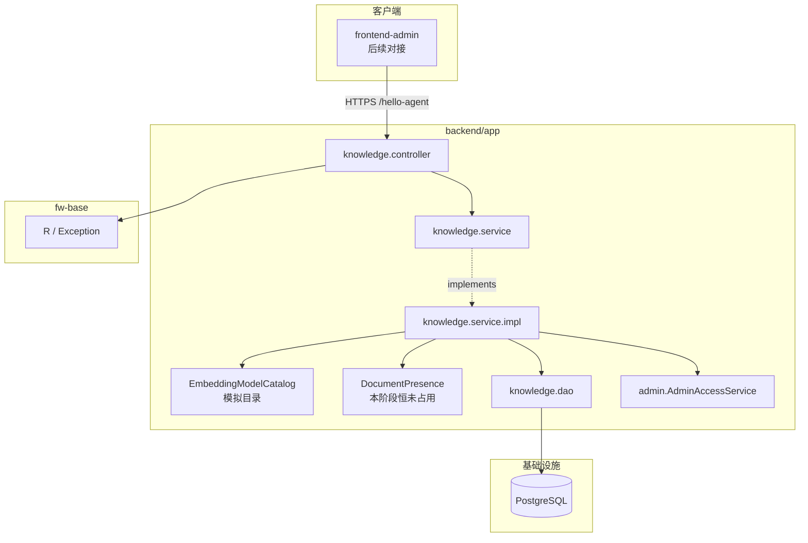

## Context

- **来源**：PRD `docs/backend/版本迭代/V0.2/prd.md`；词汇表 `docs/backend/context/knowledge/CONTEXT.md`
- **现状**：V0.1 已落地 `/admin/auth/**`、`/admin/users/**`、`loginType=admin`、Admin / Staff；Knowledge 无正式业务包（测试侧探路实体不作为规格）
- **约束**：Java 17 / Spring Boot 3；context-path `/hello-agent`；统一 `R<T>`；管理端 `/admin/**` 已登录门禁（排除 login）
- **消费方**：后续 `frontend-admin`；本变更只交付后端 API

## Goals / Non-Goals

**Goals:**

- 落地 KnowledgeBase 持久化与容器 CRUD、EmbeddingModel 模拟目录
- 行为可测，对齐 PRD AC-001～AC-017
- 预留「无 Document 才能删除」判断，本阶段无文档表时恒为未占用

**Non-Goals:**

- Document / 解析 / 切块 / 向量库 / 对象存储
- 管理端页面、真实模型注册中心、按 Namespace 筛选、改 Namespace 或 EmbeddingModel

## 组件层级

## Decisions

### D1. 模块落点

- **选择**：`com.xgc.agent.rag.knowledge`（controller / service / dao / dto / error）
- **备选**：塞进 `admin` 包 → 拒绝（账号与知识库不是同一上下文）

### D2. 表结构

表名：`t_knowledge_base`。与 `t_admin_user` 一样**物理删除、无 `deleted` 列**。迁移方式：`backend/app/src/main/resources/db/t_knowledge_base.sql` 手工执行。

| 字段 | 说明 |
| --- | --- |
| id | Snowflake 字符串 |
| name | 去首尾空白后 1–64；唯一 |
| description | 可空；最长 200 |
| namespace | 2–32，`[a-z0-9]`；唯一；创建后不可 UPDATE |
| embedding_model | 目录内标识；创建后不可 UPDATE |
| created_by / updated_by | AdminUser id |
| create_time / update_time | 审计 |

唯一约束：`uk_t_knowledge_base_name`、`uk_t_knowledge_base_namespace`。

### D3. 更新语义

- **选择**：`PUT /admin/knowledge-bases/{id}`，body 含 `name`（必填）与 `description`（可空字符串表示清空）
- **备选**：PATCH 可选字段 → 本阶段字段少，全量更新更清晰
- Namespace / EmbeddingModel 不出现在更新 body；若客户端传入，框架反序列化忽略未知字段或校验拒绝（实现选「不映射则忽略」，不得写库）

### D4. pageSize 与筛选

- pageSize 默认 20，`>100` 或 `<1` **拒绝**（可复用 `A001010`）
- 仅 query `name` 模糊；**不提供** `namespace` 查询参数

### D5. EmbeddingModel 模拟目录

- **选择**：进程内写死至少 2 个稳定标识，经 `GET /admin/embedding-models` 返回；创建时集合成员校验
- **标识（本变更写死）**：`mock-embedding-v1`、`mock-embedding-v2`
- **备选**：任意非空字符串 → 拒绝（前后端名单会漂）

### D6. Document 占用检查

- **选择**：`DocumentPresence` 端口；V0.2 实现恒返回未占用。删除路径 MUST 调用该端口。单测可注入「已占用」桩以覆盖拒删。
- **备选**：本版本省略检查 → 拒绝（下一版本补会漏契约）

### D7. 鉴权

- 登录：复用现有 `/admin/**` 拦截器
- 删除：`AdminAccessService.requireAdmin()`
- 其余：`requireLoginUser()` 写 `createdBy` / `updatedBy`
- Staff 删库错误码复用 `A001002`

### D8. 知识库错误码

新建 `KnowledgeErrorCode`（A002xxx），与账号码分开：

| 码 | 文案 |
| --- | --- |
| A002001 | 知识库不存在 |
| A002002 | 名称不符合规则 |
| A002003 | 名称已存在 |
| A002004 | Namespace 不符合规则 |
| A002005 | Namespace 已存在 |
| A002006 | 描述不符合规则 |
| A002007 | 嵌入模型不合法 |
| A002008 | 知识库下仍有文档，不能删除 |

## API 端点规范

基础前缀：`{context-path}` = `/hello-agent`。统一 `R<T>`，`code="0"` 成功。均需 `Authorization`。

| 方法 | 路径 | 鉴权 | 说明 |
| --- | --- | --- | --- |
| GET | `/admin/embedding-models` | 已登录 | 模拟目录；data 为标识列表（至少含 D5 两个 id） |
| GET | `/admin/knowledge-bases` | 已登录 | query: `page`, `pageSize`(默认20,≤100), `name?` 模糊；创建时间倒序 |
| POST | `/admin/knowledge-bases` | 已登录 | body: `{ name, description?, namespace, embeddingModel }` |
| GET | `/admin/knowledge-bases/{id}` | 已登录 | 详情 |
| PUT | `/admin/knowledge-bases/{id}` | 已登录 | body: `{ name, description? }`；不可改 Namespace / EmbeddingModel |
| DELETE | `/admin/knowledge-bases/{id}` | Admin | 无 Document 则物理删除；成功后 Namespace 可复用 |

**KnowledgeBaseView**（列表/详情/创建/更新响应）：`id`, `name`, `description`, `namespace`, `embeddingModel`, `createdBy`, `createdAt`, `updatedAt`。不得返回文档数、切片数、索引状态。

**列表 data**：与账号列表同形 `{ page, pageSize, total, records }`。

## Risks / Trade-offs

- [模拟模型标识写死] → 下一刀换真目录时保持「拉列表 + 成员校验」形状，只换 Catalog 实现
- [DocumentPresence 恒 false] → 单测强制覆盖占用分支，避免删除路径漏调用
- [物理删除立即释放 Namespace] → 本阶段无存储目录；有 Document 后删除必须先清空再调本 API
- [Name 唯一大小写敏感] → 与「去空白后精确匹配」一致；中文无大小写问题

## Migration Plan

1. 在目标库执行 `t_knowledge_base.sql`
2. 发布带新 Controller 的应用
3. 回滚：下线代码；表默认保留

## Open Questions

- 模拟目录是否在响应中带展示名（label）——本设计仅保证稳定 `id`；若前端需要 label，实现可加 `id` + `label`，id 仍为上述两个值

## Phase 1 复用清单（已关闭）

探查结论：Phase 2 起只加 Knowledge 模块，不新建登录、分页插件或迁移框架。

| 能力 | 落点 | Phase 2+ 用法 |
| --- | --- | --- |
| 登录门禁 | `AdminSaTokenConfig`：`/admin/**` + `StpAdminUtil.checkLogin()`，仅放行 `/admin/auth/login` | `/admin/knowledge-bases/**`、`/admin/embedding-models` 自动需登录，不必再配拦截器 |
| 当前用户 / Admin 门禁 | `AdminAccessService.requireLoginUser()` / `requireAdmin()` | 写 `createdBy`/`updatedBy` 用前者；删除用后者（Staff → `A001002`） |
| 统一响应 | `fw-base` `R<T>` | Controller 返回 `R.success(...)` |
| 管理端业务异常 | `WebAdminException` + `IErrorCode` | 新建 `KnowledgeErrorCode`（A002xxx），分页越界可复用 `A001010` |
| 分页 | `MyBatisPlusConfig` 已注册 PostgreSQL `PaginationInnerInterceptor`；`AdminUserServiceImpl` 默认 20、越界拒绝 | 知识库列表抄同一套 `Page` + `Wrappers`，禁止再引入一套分页框架 |
| 迁移 | 无 Flyway/Liquibase；`resources/db/t_admin_user.sql` 注明手工执行 | 同目录新增 `t_knowledge_base.sql` |

**不复用**：测试侧 `mybatisplus/KnowledgeBaseDO`（探路样例，不是规格；正式实体按 design D2 新建）。
