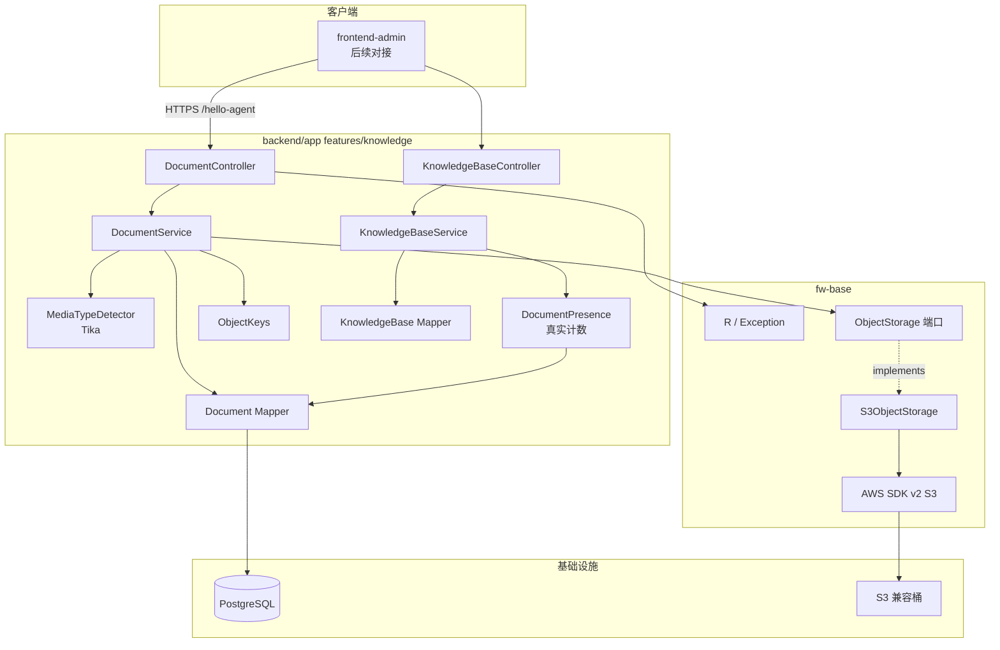

## Context

- **来源**：PRD `docs/backend/版本迭代/V0.4/prd.md`；词汇表 `docs/backend/context/knowledge/CONTEXT.md`；[ADR-0003](../../../docs/adr/0003-pluggable-object-storage.md)
- **现状**：KnowledgeBase CRUD 与配置驱动 Embedding 目录已落地（`features/knowledge`）。`DocumentPresence` 为 `EmptyDocumentPresence`（恒未占用）。`tika-core` / `tika-parsers-standard-package`、AWS SDK v2 `s3` BOM、`spring.servlet.multipart` 50MB/100MB 与 `MaxUploadSizeExceededException` 处理已存在，尚无 Document 表与存储适配器。
- **约束**：Java 17 / Spring Boot 3；context-path `/hello-agent`；统一 `R<T>`；`/admin/**` 已登录；迁移为 `resources/db/*.sql` 手工执行，无 Flyway。
- **消费方**：后续 `frontend-admin`；本变更只交付后端 API。

## Goals / Non-Goals

**Goals:**

- 落地 Document 持久化与上传/列表/详情/改策略/删除
- 源文件经可插拔 ObjectStorage 写入 S3；objectKey 系统生成且含 Namespace
- Tika 探测 MIME 白名单；策略 JSON 按种类校验
- KnowledgeBase 列表/详情返回真实 `documentCount`；有文档时 `A002008` 可触发
- 行为可测，对齐 PRD AC-401～AC-425

**Non-Goals:**

- 开始分块 / Chunk / 向量 / 索引
- URL 上传、预签名、下载/预览
- OSS 活跃后端、管理端 Document UI

## 组件层级



## Decisions

### D1. 模块落点

- **选择**：Document 用例仍在 `com.xgc.agent.rag.features.knowledge`。ObjectStorage 端口与 S3 实现在 `fw-base`（跨业务基建）。Knowledge 只生成 `{namespace}/{documentId}` 并把存储失败映射为 `A002015`。
- **备选**：适配器留在 knowledge → 拒绝（对象存储不是知识库独有）；独立 Maven `storage` 模块 → 本阶段过拆。

### D2. 表 `t_knowledge_document`

物理删除，无 `deleted` 列。手工 SQL：`backend/app/src/main/resources/db/t_knowledge_document.sql`。

| 字段 | 说明 |
| --- | --- |
| id | Snowflake 字符串 |
| knowledge_base_id | 所属库；索引 |
| original_filename | 原始文件名；非唯一 |
| media_type | Tika 规范化后的 MIME |
| byte_size | 字节大小；`> 0` |
| status | 本阶段恒 `UPLOADED` |
| enabled | 运营开关；默认 `true`；禁用不删对象、仍计入 `documentCount` |
| chunk_strategy | `OVERLAPPING` / `STRUCTURE_AWARE` |
| chunk_strategy_params | JSONB，按种类校验后的参数 |
| source_type | 恒 `LOCAL_FILE` |
| object_key | 系统生成；**不**映射到 API |
| created_by / updated_by | AdminUser id |
| create_time / update_time | 审计；改策略或 Enabled 刷新 `update_time` |

无「同库同文件名」唯一约束。索引：`(knowledge_base_id, update_time DESC)`。

### D3. objectKey

- **选择**：`{namespace}/{documentId}`；调用方不可传。
- **备选**：带 OriginalFilename → 特殊字符与同名冲突；仅 documentId → 弱化 Namespace 隔离。

### D4. ObjectStorage 端口

```
put(objectKey, bytes, mediaType)
delete(objectKey)
```

同一时刻一个活跃实现。YAML 按 `type` 分块，只校验当前活跃子块：

```yaml
hello-agentr:
  object-storage:
    type: s3          # 本阶段仅 s3；oss 选中则启动失败（适配器未交付）
    s3:
      endpoint / bucket / region / access-key / secret-key / path-style
    oss:
      endpoint / bucket / access-key / secret-key / internal-endpoint
```

结构缺必填 → **启动失败**。密钥为空 → 不挡启动，put/delete 时失败。变更仅重启生效。S3 客户端用已有 AWS SDK v2（`fw-base` 已引入）。实现抛 `ObjectStorageException`（基建码 `T000001`）；Document 用例映射为 `A002015`。OSS 实现本变更不交付，端口须可替换。

### D5. 上传事务顺序

1. 校验知识库存在、非空、大小（multipart 超限走全局处理）、Tika MIME、策略 JSON
2. 生成 id 与 objectKey，`put`
3. 插入行；失败则 `delete` 对象（失败只打错误日志，API 仍失败）

不使用预签名。一次请求一份 `MultipartFile`。

### D6. Tika

- 使用已有 `tika-core` + `tika-parsers-standard-package`（Office 容器探测）
- `Metadata` 必须设置 `RESOURCE_NAME_KEY` = OriginalFilename
- 规范化：`text/x-markdown` / `text/x-web-markdown` → `text/markdown`
- 白名单以外 → `A002011`

### D7. 策略 JSON

校验失败 → `A002013`（种类）或 `A002014`（参数）。单位：Unicode 字符。无绝对值上限。改种类整份替换。本阶段不校验 status≠UPLOADED（恒为该值）。

### D8. API 形态

嵌套在知识库下。改策略用 `PUT`（字段少，全量提交种类+参数）。分页与账号/知识库列表同形。pageSize 默认 20、越界复用 `A001010`。

### D9. DocumentPresence

- **选择**：`countByKnowledgeBaseId > 0`；删除 KnowledgeBase 仍走该端口。
- **备选**：保留 Empty 实现 → 拒绝（有文档仍能删库）。

`documentCount` 与占用检查同源 COUNT（含已禁用 Document）。列表可用子查询/二次查询，本阶段不做缓存。

### D10. 鉴权

Document 全部 `requireLoginUser()`。删 Document **不**要求 Admin。删库仍 `requireAdmin()` + 占用检查。

### D11. 错误码（A002xxx 续）

| 码 | 文案 |
| --- | --- |
| A002009 | 文档不存在 |
| A002010 | 文件为空 |
| A002011 | 文件类型不支持 |
| A002012 | 文件大小超过限制 |
| A002013 | 分块策略不合法 |
| A002014 | 分块策略参数不合法 |
| A002015 | 对象存储不可用 |
| A002016 | 文件名不符合规则 |
| A002017 | 不能修改文件名后缀 |

知识库不存在仍 `A002001`。Document id 存在但不属于该 `{kbId}` → `A002009`。multipart 超限：优先映射 `A002012`（可与全局 Handler 对齐，避免只返回 5xx）。

## API 端点规范

基础前缀：`{context-path}` = `/hello-agent`。统一 `R<T>`，`code="0"` 成功。均需 `Authorization`。

| 方法 | 路径 | 鉴权 | 说明 |
| --- | --- | --- | --- |
| POST | `/admin/knowledge-bases/{kbId}/documents` | 已登录 | multipart：`file` + `chunkStrategy` + `chunkStrategyParams`（JSON 字符串） |
| GET | `/admin/knowledge-bases/{kbId}/documents` | 已登录 | query: `page`, `pageSize`(默认20,≤100), `originalFilename?` 模糊；**更新时间倒序** |
| GET | `/admin/knowledge-bases/{kbId}/documents/{docId}` | 已登录 | 详情 |
| PUT | `/admin/knowledge-bases/{kbId}/documents/{docId}/chunk-strategy` | 已登录 | body: `{ chunkStrategy, chunkStrategyParams, originalFilename? }`；改名只改主名 |
| PUT | `/admin/knowledge-bases/{kbId}/documents/{docId}/enabled` | 已登录 | body: `{ enabled }` |
| DELETE | `/admin/knowledge-bases/{kbId}/documents/{docId}` | 已登录 | 同步删记录与对象 |

既有 KnowledgeBase 端点不变；**KnowledgeBaseView 增加 `documentCount`**（列表/详情/创建/更新响应）。不得返回切片数、索引状态。

**DocumentView**：`id`, `knowledgeBaseId`, `originalFilename`, `mediaType`, `byteSize`, `status`, `enabled`, `chunkStrategy`, `chunkStrategyParams`, `sourceType`, `createdBy`, `createdAt`, `updatedAt`。MUST NOT 含 `objectKey`。

**列表 data**：`{ page, pageSize, total, records }`。

**chunkStrategyParams**

- `OVERLAPPING`：`chunkSize` > 0；`0 ≤ overlap < chunkSize`
- `STRUCTURE_AWARE`：`minChunkSize ≤ defaultChunkSize ≤ maxChunkSize`；三者 > 0；`0 ≤ overlap < minChunkSize`

## Risks / Trade-offs

- [库写入失败后对象回滚再失败] → 打错误日志含 objectKey；不引入补偿任务
- [Tika Markdown 依赖文件名] → 探测必须带 OriginalFilename
- [同步删对象使删除变慢/易失败] → 对象失败则整笔失败，避免桶与库不一致
- [S3 SDK 在 fw-base、业务在 app] → 端口与适配器同在 fw-base；Knowledge 只保留 objectKey 约定与 A002015 映射
- [列表增加 documentCount] → 兼容性：多字段 JSON；管理端未用则可忽略

## Migration Plan

1. 目标库执行 `t_knowledge_document.sql`
2. 配置 ObjectStorage YAML 与密钥环境变量；重启
3. 发布应用
4. 回滚：下线代码；表与桶对象默认保留；恢复 EmptyDocumentPresence 前须知有文档的库可被误删

## Open Questions

- 本地验收用真实 S3 还是 Testcontainers/MinIO（工程自定，契约不绑厂商）
- `chunkStrategyParams` 用 JSONB 或 TEXT：推荐 JSONB，实现可改但不改变 API 形状

## Phase 1 复用清单（已关闭）

探查结论：Phase 2 起只加 Document 持久化；ObjectStorage 基建在 fw-base，不新建登录、分页框架、迁移框架或第二套 S3 SDK。

| 能力 | 落点 | Phase 2+ 用法 |
| --- | --- | --- |
| 登录门禁 | `AdminInterceptorConfig`：`/admin/**` + `StpAdminUtil.checkLogin()`，仅放行 `/admin/auth/login` | `/admin/knowledge-bases/{id}/documents/**` 自动需登录，不必再配拦截器 |
| 当前用户 / Admin 门禁 | `AdminAccessService.requireLoginUser()` / `requireAdmin()` | Document 写审计用前者；删 Document 不要求 Admin；删库仍用后者 |
| 统一响应 | `fw-base` `R<T>` | Controller 返回 `R.success(...)` |
| 管理端业务异常 | `WebAdminException` + `IErrorCode` | 续编 `KnowledgeErrorCode` A002009–A002015 |
| 分页 | `KnowledgeBaseServiceImpl` 默认 20、越界 `A001010` | Document 列表抄同一套 `Page` + `Wrappers`，禁止再引入分页框架 |
| 占用端口 | `DocumentPresence` + `EmptyDocumentPresence` | Phase 3 换成真实 COUNT；删除知识库路径已调用，不得绕过 |
| 迁移 | 无 Flyway；`resources/db/t_knowledge_base.sql` 手工执行 | 同目录新增 `t_knowledge_document.sql` |
| Tika | `app/pom.xml` 已有 `tika-core` + `tika-parsers-standard-package`（3.2.3） | 探测器写在 knowledge 包，不新增解析/切块 |
| S3 SDK / ObjectStorage | `fw-base` 声明 SDK，并提供端口与 S3 适配器 | Knowledge 注入 `ObjectStorage`，用 `ObjectKeys` 生成键；失败映射 `A002015` |
| multipart 上限 | `application.yaml`：`max-file-size: 50MB`、`max-request-size: 100MB` | 继续用部署配置，不写死领域常量 |
| 超限异常 | `GlobalExceptionHandler.maxUploadSizeExceededException` 目前返回宏观码 **`A000001`** | Phase 4 须对齐 design：管理端文档上传超限映射 **`A002012`**（改 Handler 对 `/admin` 上传路径，或在进入业务前校验 size） |

**不复用 / 不改**：`EmptyDocumentPresence` 作为长期实现（必须替换）；把 Document / Namespace / objectKey 约定下沉到 fw-base；Flyway。
