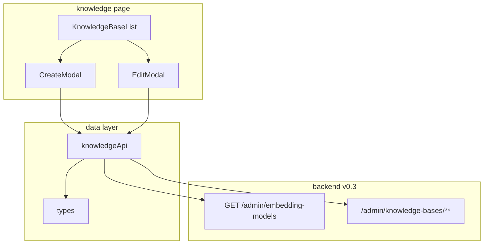

## Context

- **来源**：`docs/frontend-admin/版本迭代/V0.3/prd.md`、`docs/frontend-admin/版本迭代/V0.3/ixd.md`
- **现状**：V0.2 前端按 `string[]` 消费模型目录
- **目标**：对齐后端 V0.3 对象目录契约，同时保持知识库 CRUD 页面交互稳定

## Goals / Non-Goals

**Goals:**

- 目录对象契约接入
- 创建提交参数映射正确（`embeddingModel=id`）
- 失败态可诊断（目录失败、业务失败）
- 不破坏 Staff/Admin 现有权限体验

**Non-Goals:**

- 后端改造
- Provider 可视化管理
- Chat/LLM 配置消费

## 组件层级图

## Decisions

### D1. 下拉值映射

- **选择**：`option.value = id`；创建提交 `embeddingModel=id`
- **原因**：后端契约已明确 `embeddingModel` 绑定模型 `id`

### D2. 下拉展示字段

- **选择**：V0.3 先显示 `id`
- **原因**：后端无 `displayName`，且当前业务沟通以模型 id 为准

### D3. 失败态策略

- **选择**：目录失败时禁止提交，不做“离线缓存上次目录”
- **原因**：避免提交过时模型 id，导致误建库

### D4. 列表展示策略

- **选择**：继续展示 KnowledgeBase 记录中的 `embeddingModel`
- **原因**：与 V0.2 视觉和后端实体一致，避免联表推断

## API 端点规范（前端消费）

| 方法 | 路径 | 使用点 |
| --- | --- | --- |
| GET | `/admin/embedding-models` | 创建模态打开时拉目录 |
| POST | `/admin/knowledge-bases` | 提交创建 |
| GET | `/admin/knowledge-bases` | 列表 |
| PUT | `/admin/knowledge-bases/{id}` | 编辑 |
| DELETE | `/admin/knowledge-bases/{id}` | 删除（Admin） |

目录项前端类型：

- `id: string`
- `model: string`
- `dimension: number`
- `providerId: string`
- `priority: number`
- `isDefault: boolean`

## Risks / Trade-offs

- 仅展示 `id` 对业务同学不够友好，但当前最稳妥
- 不做目录缓存，创建弹窗每次需依赖接口可用性

## Open Questions

- 是否在后续版本引入展示名字段（需后端新增 `displayName`）

## Phase 1 复用清单（已关闭）

| 能力 | 现有落点 | Phase 2 处理方式 |
| --- | --- | --- |
| 知识库数据层 | `src/shared/api/knowledge.ts` | 仅升级目录返回类型，不重建 API 模块 |
| 创建模态 | `src/pages/knowledge-bases/CreateKbModal.tsx` | 保留现有状态机，改目录项类型与下拉映射 |
| 列表页与列展示 | `KnowledgeBasesPage.tsx` + `KnowledgeBaseTable.tsx` | 维持 `embeddingModel` 列展示，避免额外派生字段 |
| 错误处理与 Toast | `ApiError` + `toast-store` | 复用既有业务错误透传与提示 |
| 类型基线 | `src/shared/api/types.ts` | 新增目录项类型，保持 `KnowledgeBaseView` 不变 |

**映射清单（确认）**

- 目录接口响应：`EmbeddingModelCatalogItem[]`（`id/model/dimension/providerId/priority/isDefault`）
- 创建下拉：`option.value = id`
- 创建提交：`embeddingModel = selected.id`
